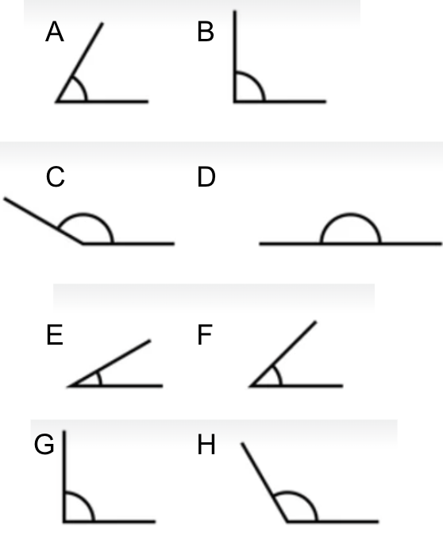

**1)** Responde para cada número con N, E, Re, Ra o I según sea Naturales, Enteros, Reales,
Racionales o Irracionales. Responder con la categoría más restrictiva, ej: 1 -> R: N.

    a- 198
    b- 4
    c- -3.1
    d- -1/4
    e- 10.0
    f- 2*e
    g- -123.0004

**2)** Calcula los siguientes porcentajes y y redondea la respuesta a su PRIMER número decimal

    a- 30% de 2000
    b- 2000% de 30
    c- 10% de 150
    d- 25.5% de 27
    e- 25.5% de 0.9

**3)** Calcula la relación porcentual entre los siguientes números y redondea la respuesta a su PRIMER número decimal. Ej: X% de 20 es 2 -> R: 10

    a- X% de 150 es 50
    b- X% de 4.0 es 100.0
    c- X% de 16/4 es 2
    d- X% de 10*Pi es 2*Pi
    e- X% de 3500 es 2500

**4)** De shopping compré varias prendas por un valor de 350$. Había una promo del 30% sobre la cual se aplico luego
un descuento con la tarjeta de fidelidad. Finalmente pagué 196$. Redondea la respuesta a su PRIMER número decimal

    a- De qué porcentaje fue el descuento con la tarjeta de fidelidad?
    b- Cuánto dinero me ahorré por la promo y cuanto por la tarjeta de fidelidad?

**5)** Para cada medida en grados a continuación, responde con la letra que corresponde al ángulo de la figura.

  - 30
  - 45
  - 60
  - 90
  - 150
  - 120
  - 180
  - 90

**6)** Para un triángulo rectángulo de cateto_1 = 2, cateto_2= 3 e hipotenusa = 3.6, responde (redondea la respuesta a su PRIMER número decimal):

    a- Cuál es su seno?
    b- Cuál es su coseno?
    c- Cuál es su tangente?

Usando las funciones inversas en la calculadora (o bien en internet) arccos, arcsin y/o arctan, responder:

    d- Cuántos grados mide el menor de los dos ángulos agudos?
    e- Y el mayor?

**7)** Elige la opción correcta para cada caso.

    a- 0 = 
        i- cos(0)
        ii- sen(0)
    b- 1 = 
        i- cos(0)
        ii- sen(0)
    c- -1 =
        i- cos(90)
        ii- sen(270)
    d- 0 =
        i- cos(180)
        ii- tg(180)
