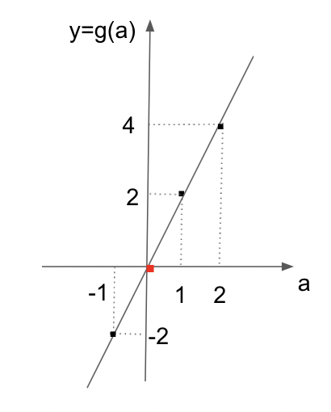

# Introducción a Cálculo I

## Filosofia de este curso

Si la matemática nunca fue lo tuyo, te invitamos a olvidar lo aprendido y a “empezar de cero”! El objetivo de este curso es de revisar conceptos fundamentales que van a ayudarte a entender mejor temas claves a la data/ data science como lo son la probabilidad, estadística o machine learning. 
Como hoy en día los cálculos los hace la computadora, y estamos conscientes de ello, no vamos a insistir en la resolución de ejercicios complejos que no solo lleva tiempo sino que puede traer frustración innecesaria. 
Por ello, abordaremos los temas seleccionados desde lo conceptual, con ejemplos precisos e invitandote a abrir la mente hacia una nueva manera de aprender matemática.
Por último, el fin de este documento es presentar un temario variado de conceptos que 
nos parecen importantes a tener en cuenta. P
ara que sea de fácil lectura, los temas no están desarrollados en gran profundidad. 
Por ello, es imperativo consultar los materiales adicionales propuestos en cada sección.
Además, te recomendamos fuertemente googlear los temas que te interesen o que necesiten más explicación!

Vamos!

## Temario

* Conceptos generales
* Funciones
* Gráficos
* Ecuación de la recta
* Continuidad
* Derivabilidad
* Operar con log, raiz, potencias
* Función discreta: concepto
* Función multivariable: concepto

## Conceptos generales

### Tipos de números

Según su naturaleza; existen los siguientes tipos de números

* **Naturales**: 0, 1, 2, … (enteros, es decir sin coma, mayores o iguales que cero)
* **Enteros**: -2, -1, 0, 1…(Naturales + los enteros negativos)
* **Reales**
  * *Racionales*: números con coma que pueden representarse como una fracción 
  1.223, 100002.44
  * *Irracionales*: números con coma que NO pueden representarse como una fracción y tienen infinitos digitos tras la coma 
  Típicos ejemplos son el famoso “Pi”, “e” o el “numero de oro” (mas info http://xtec.cat/~fgonzal2/curio_irrac.html)

Cada uno de estos grupos, o conjuntos, tienen infinitos elementos. Es decir, para cualquier numero elegido siempre va a haber un numero mayor (o menor en el caso de un negativo). El concepto de infinito es recurrente en matematica.

Una fracción es una división entre dos números. En muchas aplicaciones se usa la nomenclatura XYdonde X e Y son diferentes números Enteros. Por ejemplo, en vez de 0.5 se puede escribir 12y se lee “un medio” o mundanamente “la mitad”. Mas en http://hnaranjo.com/blog/numeros-racionales/.

Como podes imaginar, la ventaja de los números racionales es que por mas “largos” que sean (largos=digitos después de la coma) siempre se pueden representar en su totalidad. En cambio, un número irracional no se puede representar totalmente en una cantidad finita de digitos.

Cada tipo tiene usos diferentes. Por ejemplo, en programación un número entero no se guarda en memoria de la misma manera que un racional. Otra diferencia existe en el uso de distintos tipos de números para representar la realidad a través de datos en algoritmos de machine learning. 

Si buscas en internet vas a encontrar más categorías como los complejos, imaginarios, periódicos cuya definición es interesante pero menos relevante a este curso. 

En el siguiente grafico vas a encontrar las relaciones entre los conjuntos mencionados.

**Material adicional:**
* Lectura 1
* Video 1

### Porcentajes

Rápidamente, revisaremos cómo calcular porcentajes (o proporciones, o fracciones).

Usamos porcentajes para relacionar cualquier número a 100. Cuando decimos “el 30% de 2000” nos referimos a la cantidad que sea a 2000 como lo es 30 a 100. Hay varias formas de calcularlo:

* regla de 3:  

        100 ----- 30
        2000 ------ X
        
        X=30*2000 / 100 = 600

* fracciones:

        30% es lo mismo que 30/100, entonces para calcular el 30% de 2000 hacemos 30/100* 2000 (regla para recordar, “de” en matemática se traduce a “*”) que es igual a 30/100 * 200 = 600

* número decimal:

       30% es lo mismo que 30/100que es lo mismo que 0,3.
       Entonces, podemos hacer directamente 0,3 * 2000 = 600

Naturalmente, las 3 opciones llevan al mismo cálculo y resultado. Podes elegir la que te resulte más sencilla.			

Por último, un porcentaje no es necesariamente un número menor. Por ejemplo, el 230% de 2000 es

    X=230*2000 / 100 = 4600
    230/100* 2000 = 4600
     2,3 * 2000 = 600

o también “el doble (200%) más el 30%” o sea 2000*2+600.

**Material adicional:**
* Lectura 1
* Video 1

### Geometría: Ángulos y trigonometría 

Un ángulo se puede definir como la medida de abertura entre dos rectas. El concepto se usa mucho en análisis matemático y álgebra ya que mide la relación entre distintos elementos en el espacio, o la inclinación de una recta respecto a la horizontal. 

En grados, una abertura nula corresponde a 0°. Cuando dos rectas tienen un ángulo de 0, se dice que son paralelas. Luego podemos ir agrandando el ángulo hasta 90°, donde los dos vectores son perpendiculares (ver en la imagen). Un cuadrado tiene cuatro ángulos de 90° que se llaman también ángulos rectos. Si seguimos agrandando en un momento volvemos a crear una horizontal, que es equivalente a dos veces una abertura recta o sea 180°. Con esta lógica, el ángulo se puede seguir agrandando hasta la posición inicial habiendo recorrido 360°. 360° corresponde entonces a la misma posición que 0°, pero indicando que se ha recorrido el círculo entero una vez (lo cual tiene aplicaciones en casos donde se analizan por ejemplo movimientos en función del tiempo).

Solo porque nociones como seno y coseno son bastante usadas en cálculo y álgebra, vamos a refrescar los conceptos yendo a los puntos claves. 

Tomando cualquier ángulo entre dos rectas del ejemplo anterior, podemos trazar una recta (azul) más entre ambas y formar un triángulo. 

Si además la recta que trazamos forma un ángulo recto con alguna de las existentes (señalado en el ejemplo con un cuadradito), tenemos lo que se llama un triángulo recto el cual es muy utilizado entre otras cosas, por su seno y coseno.

Esquema de un ángulo recto y el nombre que se les da a sus lados:

Cada uno de los lados (X,Y,H) tienen una medida (por ejemplo, en centímetros). En matemática, cuando nos referimos a la medida de un segmento usamos || alrededor de su nombre. En este caso, |X| es la medida del lado que hemos llamado X, por ejemplo 1,5 cm. Con estos 
conceptos en mente, seno, coseno y tangente del  ángulo  en cuestión son:

**coseno**=|X|/|H| (la medida del lado contiguo, aca llamado X, dividido la medida del lado H)

**seno**=|Y|/|H| (la medida del lado opuesto, aca llamado Y, dividido la medida del lado H)

**tangente**=|Y|/|X| (que es lo mismo que seno/coseno)

Yendo un poco más allá: imaginemos un triángulo como este, donde |H|=1. En este caso, tenemos directamente que
coseno=|X|, seno=|Y| y tangente=|Y|/|X|

Si H mide 1, X e Y miden imperativamente menos que 1 (tiene lógica!), por lo que el seno y el coseno pueden valer entre 0 y 1 (también valores negativos, entre 0 y -1 para ángulos entre 180° y 360°). 
Si imaginamos  ángulo  tan chico como sea posible (0°), entonces el lado Y desaparece (|Y|=0) y |X|=|H|=1. 
Es decir, el seno(0°)=0 y el coseno(0°)=1. Con la misma lógica, si abrimos  ángulo  hasta los 90° sucede lo contrario donde X desaparece (|X|=0) y |Y|=|H|=1. 
Entonces, el seno(90°)=1 y el coseno(90°)=0. En la sección Gráficos, veremos qué forma tienen esas relaciones visualmente.

**Material adicional:**
* Lectura 1
* Video 1

## Funciones

### Definición

Uno de los conceptos más importante del análisis matemático, y sin dudas el más importante de este módulo, es el de **función**. 
Una **función** es una relación entre elementos de **entrada** y elementos de **salida**. 
También podemos pensar a una función como una fábrica 
a la cual entran elementos y salen otros. 
Por ejemplo, una fábrica de galletitas utiliza 10gr de azúcar por paquete de 20. Por cada gramo de azúcar que entra a la fábrica, sale una galletita y cada 20 galletitas, un paquete.

Esta relación se puede escribir en forma de tabla de la siguiente forma:

Para explicar el trabajo de esta fábrica de la manera más sencilla posible, 
nos conviene extraer la relación de manera numérica. 
En este caso, podemos ver que independientemente de la cantidad de gramos de azúcar que entran,
el número de galletitas que salen es el doble de esa cantidad:

i- **galletitas = gramos_azúcar * 2**

En cuanto a cantidad de paquetes, la relación es de

ii- **paquetes = galletitas / 10**

Para obtener el numero de paquetes en función de la cantidad de azúcar y no del número de galletitas,
podemos reemplazar [**galletitas**] por su equivalente [**gramos_azúcar * 2**] y nos queda

iii- **paquetes = [gramos_azúcar * 2] / 10 = gramos_azúcar / 5**

La operación que acabamos de realizar se llama también **composición de funciones** y tiene muchas aplicaciones en
la vida real. Pueden leer más sobre funciones compuestas empezando por https://es.wikipedia.org/wiki/Funci%C3%B3n_compuesta.

Siguiendo con la idea de simplificar las expresiones, en matemática en general usamos la manera más corta posible
de referirnos a las cosas, lo cual es en general su primera letra: **galletitas = g**, **gramos_azúcar = a**
y **paquetes = p**. Entonces

iv- **g = 2 * a** .

Para los paquetes podemos definir dos relaciones, en función de gramos de azúcar y en función de galletitas.
Para aclarar en función de qué cantidad esta definida la relación, se usan paréntesis:

v- **p(g) = g / 10** 

y 

**p(a) = a / 5**

Pasando de fracciones a número decimal, obtenemos

vi- **p(g) = 0,1 * g** 

y 

**p(a) = 0,2 * a**

### Dominio e imágen

Las relaciones que definimos hasta ahora, en principio, no definen que rango permite en entrada.
Por ejemplo, si entran 10M de gramos en un dia, la fábrica satura y no puede fabricar al mismo 
ritmo que antes. Para establecer en que rango de entrada una función es válida se define su **dominio**.
En nuestro ejemplo, podemos decir que el dominio de iv es D={0,10M} (de 0 a 10M) ya que 
valores negativos no tienen sentido en este caso y a partir de 10M la fabrica satura y fabrica mas 
lentamente. Otro concepto importante es el de **imagen**. La imagen de una funcion es el rango de datos de salida
de la misma y depende del dominio. Para iv, con el dominio que hemos definido, la Im={0,20M}.

Toda función posee un dominio e imagen natural que pueden ser luego restringidos por razones prácticas.
En nuestro ejemplo, el dominio natural es Dom={-inf, inf}=R (se lee de menos infinito a infinito, que es equivalente a R, todos los numero reales existentes) ya que la funcion admite como entrada cualquier
número. Un contra ejemplo sería la función **y = 1/x** ya que ESTA PROHIBIDO dividir por cero. Entonces,
el dominio natural de esta función es Dom=R-{0} (se lee todos los reales menos el 0).

### Función partida

Como hemos visto, toda función tiene su dominio e imagen naturales sobre lo que se puede definir un dominio igual o mas restrictivo
en función del fenomeno que se desea describir. A veces, un fenomeno es mas complejo y se comporta de manera diferente
para distintos rangos de entrada. Para estos casos, podemos hacer uso de **funciones partidas**.

Como dijimos, la fábrica a partir de 10M g de azúcar ya no puede fabricar al mismo ritmo. 
Hasta 10M g fabrica 20M galletitas. Si recibe mas azúcar, el restante (a - 10M) va a ser procesado 
menos eficazmente obteniendo solo 1 galletita por gramo y desperdiciando azúcar.
Como vemos en la definición, la fábrica no acepta mas de 20M g de azúcar.

Con el concepto de dominio e imagen, podemos definir: 
"Una función matemática es una relación que se establece entre dos conjuntos, a través de la cual a cada 
elemento del primer conjunto (dominio) se le asigna un único elemento del segundo conjunto (imagen) o ninguno. "

**video: mas ejemplos! puede ser la velocidad y algo que sube y baja
mencionar variable dependiente, independiente**

**Material adicional:**
* Lectura 1
* Video 1

## Gráficos

En teoría del cálculo, el gráfico de una función es el conjunto de puntos que resulta de asociar a cada elemento
del dominio su imagen correspondiente. Podemos imaginar esta representación en formato de tabla como vimos al principio de la sección,
donde cada linea representa un punto. 

Para permitir una lectura mas rapida e inteligible del comportamiento de una función, es muy usual
representar sus puntos en un **eje de coordenadas**.

La variable que se representa en el eje horizontal se llama variable independiente (y se represetna muchas veces con la
letra x) mientras que la que se representa en el eje vertical se llama variable dependiente (y muchas veces la van a encontrar
con el nombre de y).

**Representación de un punto en el eje de coordenadas**

**Representación de la relación g(a) = 2 * a**

**Representación de la función compuesta que define g(a)**

Como pueden imaginar, existen muchísimas otras maneras de representar visualmente la relación entre datos además del eje de coordenadas!

**video y ejercicios: mostrar mas funciones, diferentes dibujos
ejercicios: hacer otros dibujos**

**Material adicional:**
* Lectura 1
* Video 1

## Ecuación de la recta

La recta, su representación en el eje y su función asociada son de los elementos pas usados en la para representar 
distintos fenómenos (con distintos niveles de aproximación) del mundo físico.

Como vimos en nuestro ejemplo anterior, podemos modelizar la producción de galletitas de una fábrica en función 
de los gramos de azúcar disponibles como **g(a) = 2 * a**. Su gráfica en ejes cartesianos tiene la forma:

Como se puede ver, geométricamente esta función determina una **recta** que pasa por el origen 
de coordenadas, representado por un punto rojo cuando a=0 y g=0, o (0,0).
A diferencia de antes, donde habíamos definido un dominio mayor a cero (ya que no tiene sentido hablar de valores
negativos de gramos de azúcar para este caso), ahora extendimos la gráfica de la recta a valores negativos de **a**,
lo cual da como resultado valores negativos de **g**. Otro aspecto fundamental de la recta es su **inclinación**.
Una inclinación de 0 da como resultado una recta horizontal, paralela al eje **x** (o **a** en este ejemplo).
En este caso, la inclinación es de **2** ya que por cada incremento de una unidad de la variable independiente **a**,
la variable dependiente **g** aumenta de 2. El valor de la inclinación, también llamada pendiente, puede aumentar indefinidamente.
Cuando este valor "tiende a" o "se parece a" infinito (veremos el concepto de tendencia mas adelante)
la recta resultante se parece a una vertical.

**EJERCICIOS: dibujar rectas
es funcion o no
por que 'se parece a' y no 'es'
VIDEO; mas ejemplos de casos modelizados lineales**

Con estos conceptos, definimos la función que describe una recta como

**y(x) = a * x + b**

donde **a** corresponde a la **pendiente** y **b** se llama **coordenada al orígen** (y refiere al valor de la función que corresponde a x=0).

La pendiente de una recta esta también intimamente relacionada con con ángulo que forma la recta con el eje horizontal, de la siguiente forma:

**a = tan(ang)**

## Continuidad

### Comentario general

En análisis matemático nos preguntamos a menudo sobre qué sucede en cada punto del dominio de una función.
Por suerte, para la gran mayoría de las funciones que utilizamos para representar fenómenos, estas condiciones se repiten en "casi" todos o
todos los puntos del dominio. 
Nos interesa en general, entonces, entender si existen excepciones o puntos especiales y qué sucede en esos casos.

### Límites

Cuando hablamos de límites, nos interesa saber qué sucede **alrededor** de un cierto punto del 
dominio (o no) de una función.

Tomemos la función 

**y = f(x) = 1/x** (se lee **y** es igual a una función de **x** y es igual a unos sobre **x**)

El dibujo de su gráfica es el siguiente:

Como lo hemos mencionado, el dominio natural de esta función es D=R-{0} (todos los reales menos el 0) ya que
no se admite dividir por cero. Por otro lado, cualquier otro número es válido en esa ecuación.

Como dijimos, nos interesa entender como se comporta la función en cada punto y en particular si hay puntos
donde su comportamiento es diferente. Tomemos un punto cualquiera, por ejemplo **a** (imagen). Queremos saber 
qué pasa con **f(x)** cuando x "se acerca a" **a**. Como estamos en una dimensión, puedo acercarme a un elemento del 
dominio por dos caminos: derecha o izquierda (numeros mayores que **a** o menores).

Si me acerco a **a** por izquierda (es decir, valores menores que **a** o también: **lim (-) x -> a**, límite
por izquierda cuando **x** tiende a **a**) 
siguiendo la flecha rosa en la imagen, se ve que 
la función (**y = f(x)**) se va acercando a **f(a)**. Recuerden que el **limite** se interesa a lo
que pasa **alredor**
de un punto, y no **en** en punto en si. Si ahora hago el mismo ejercicio acercándome por derecha
(valores mayores que **a** o también: **lim (+) x -> a**, límite
por derecha cuando **x** tiende a **a**) siguiendo la flecha
roja en la imagen, la función (**y = f(x)**) se va acercando a **f(a)**, al igual que en su límite
por izquierda.

Para el punto **a** podemos decir, entonces, que ambos limites por derecha e izquierda existen, son finitos e iguales.
Ya se que a esta altura el análisis de limites parece bastante trivial y de poca utilidad, sigamos.

Miremos ahora a ver qué pasa alrededor del punto **x=0** (no en **x=0** ya que es un punto fuera del dominio donde la función ni siquiera esta definida).

Punto a, luego 0. Dominio, no dominio limites derecha e izquierda
 Agregamos el 0 al dominio, y que sucede?

**ejercicios y videos mas ejemplos! hay miles, por ejemplo funcion escalonada. interesante ver su definicion 
analitica**

**Material adicional:**
* Lectura 1
* Video 1

### Continuidad

Con la definicion de limite, la continuidad se hace sencilla a describir. Definir bien en el ejemplo de la imagen anterior y ya.

## Derivabilidad

**Material adicional:**
* Lectura 1
* Video 1
* 
## Operar con log, raiz, potencias

**Material adicional:**
* Lectura 1
* Video 1
* 
## Función discreta: concepto

Volviendo al ejemplo de galletitas, no tiene sentido hablar de 1,5...

**Material adicional:**
* Lectura 1
* Video 1

## Función multivariable: concepto