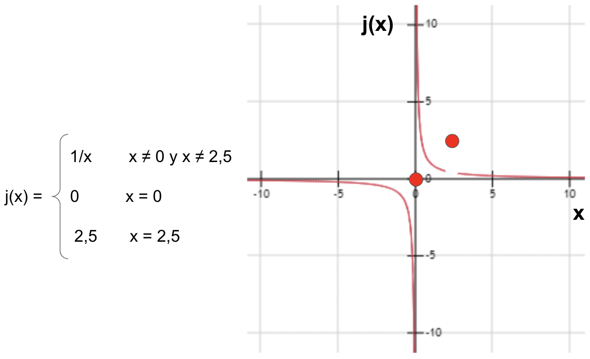
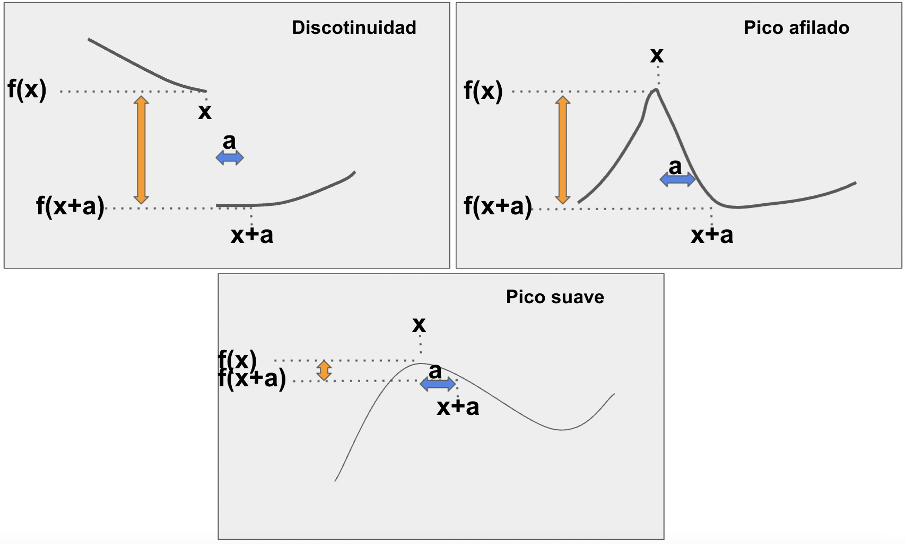
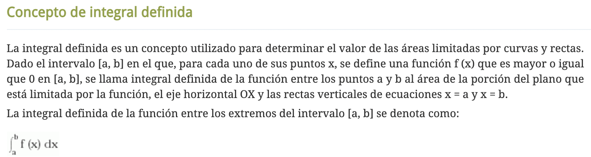
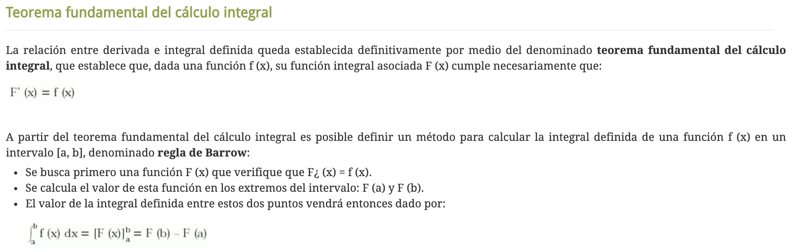
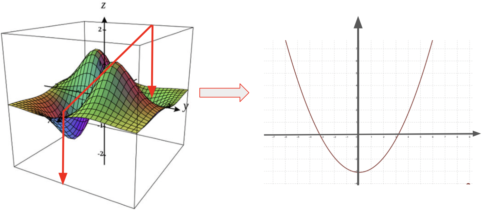

# Introducción a Cálculo I

## Temario

* Conceptos generales
* Funciones
* Gráficos
* Ecuación de la recta
* Continuidad
* Derivabilidad
* Función discreta: concepto
* Función multivariable: concepto

## Conceptos generales

### Tipos de números

Según su naturaleza; existen los siguientes tipos de números

* **Naturales**: 0, 1, 2, … (enteros, es decir sin coma, mayores o iguales que cero)
* **Enteros**: -2, -1, 0, 1…(naturales + los enteros negativos)
* **Reales**
  * *Racionales*: números con coma que pueden representarse como una fracción 
  1.223, 100002.44
  * *Irracionales*: números con coma que NO pueden representarse como una fracción y tienen infinitos dígitos tras la coma 
  Los ejemplos típicos son el famoso “Pi”, “e” o el “numero de oro” (mas info http://xtec.cat/~fgonzal2/curio_irrac.html)

Cada uno de estos grupos, o conjuntos, tienen infinitos elementos. Es decir, para cualquier número elegido siempre va a haber un número mayor (o menor en el caso de un negativo). El concepto de infinito es recurrente en matemática.

Una fracción es una división entre dos números. En muchas aplicaciones se usa la nomenclatura XY donde X e Y son diferentes números Enteros. Por ejemplo, en vez de 0.5 se puede escribir 1/2 y se lee “un medio” o mundanamente “la mitad”. Mas en http://hnaranjo.com/blog/numeros-racionales/.

Como puedes imaginar, la ventaja de los números racionales es que por más “largos” que sean (largos=dígitos después de la coma) siempre se pueden representar en su totalidad. En cambio, un número irracional no se puede representar totalmente en una cantidad finita de dígitos.

Cada tipo tiene usos diferentes. Por ejemplo, en programación un número entero no se guarda en memoria de la misma manera que un racional. Otra diferencia existe en el uso de distintos tipos de números para representar la realidad a través de datos en algoritmos de machine learning. 

Si buscas en internet vas a encontrar más categorías como los complejos, imaginarios, periódicos cuya definición es interesante pero menos relevante a este curso. 

En el siguiente gráfico vas a encontrar las relaciones entre los conjuntos mencionados.

[comment]: <> (**Material adicional:**)

[comment]: <> (* Lecturas)

[comment]: <> (* Videos)

### Porcentajes

Rápidamente, revisaremos cómo calcular porcentajes (o proporciones, o fracciones).

Usamos porcentajes para relacionar cualquier número a 100. Cuando decimos “el 30% de 2000” nos referimos a la cantidad que sea a 2000 como lo es 30 a 100. Hay varias formas de calcularlo:

* regla de 3:  

        100 ----- 30
        2000 ------ X
        
        X=30*2000 / 100 = 600

* fracciones:

        30% es lo mismo que 30/100, entonces para calcular el 30% de 2000 hacemos 30/100* 2000 (regla para recordar, “de” en matemática se traduce a “*”) que es igual a 30/100 * 200 = 600

* número decimal:

       30% es lo mismo que 30/100 que es lo mismo que 0,3.
       Entonces, podemos hacer directamente 0,3 * 2000 = 600

Naturalmente, las 3 opciones llevan al mismo cálculo y resultado. Podes elegir la que te resulte más sencilla.			

Por último, un porcentaje no es necesariamente un número menor. Por ejemplo, el 230% de 2000 es:

    X=230*2000 / 100 = 4600
    230/100* 2000 = 4600
     2,3 * 2000 = 600

o también “el doble (200%) más el 30%” o sea 2000*2+600.

[comment]: <> (**Material adicional:**)

[comment]: <> (* Lectura 1)

[comment]: <> (* Video 1)

### Geometría: Ángulos y trigonometría 

Un ángulo se puede definir como la medida de abertura entre dos rectas. El concepto se usa mucho en análisis matemático y álgebra ya que mide la relación entre distintos elementos en el espacio, o la inclinación de una recta respecto a la horizontal. 

En grados, una abertura nula corresponde a 0°. Cuando dos rectas tienen un ángulo de 0, se dice que son paralelas. Luego podemos ir agrandando el ángulo hasta 90°, donde los dos vectores son perpendiculares (ver en la imagen). Un cuadrado tiene cuatro ángulos de 90° que se llaman también ángulos rectos. Si seguimos agrandando en un momento volvemos a crear una horizontal, que es equivalente a dos veces una abertura recta o sea 180°. Con esta lógica, el ángulo se puede seguir agrandando hasta la posición inicial habiendo recorrido 360°. 360° corresponde entonces a la misma posición que 0°, pero indicando que se ha recorrido el círculo entero una vez (lo cual tiene aplicaciones en casos donde se analizan por ejemplo movimientos en función del tiempo).

Solo porque nociones como seno y coseno son bastante usadas en cálculo y álgebra, vamos a refrescar los conceptos yendo a los puntos claves. 

Tomando cualquier ángulo entre dos rectas del ejemplo anterior, podemos trazar una recta (azul) más entre ambas y formar un triángulo. 

Si además la recta que trazamos forma un ángulo recto con alguna de las existentes (señalado en el ejemplo con un cuadradito), tenemos lo que se llama un triángulo recto el cual es muy utilizado entre otras cosas, por su seno y coseno.

Esquema de un ángulo recto y el nombre que se les da a sus lados:

Cada uno de los lados (X,Y,H) tienen una medida (por ejemplo, en centímetros). En matemática, cuando nos referimos a la medida de un segmento usamos || alrededor de su nombre. En este caso, |X| es la medida del lado que hemos llamado X, por ejemplo 1,5 cm. Con estos 
conceptos en mente, seno, coseno y tangente del  ángulo  en cuestión son:

**coseno**=|X|/|H| (la medida del lado contiguo, aca llamado X, dividido la medida del lado H)

**seno**=|Y|/|H| (la medida del lado opuesto, aca llamado Y, dividido la medida del lado H)

**tangente**=|Y|/|X| (que es lo mismo que seno/coseno)

Yendo un poco más allá: imaginemos un triángulo como este, donde |H|=1. En este caso, tenemos directamente que
coseno=|X|, seno=|Y| y tangente=|Y|/|X|

Si H mide 1, X e Y miden imperativamente menos que 1 (tiene lógica!), por lo que el seno y el coseno pueden valer entre 0 y 1 (también valores negativos, entre 0 y -1 para ángulos entre 180° y 360°). 
Si imaginamos  ángulo  tan chico como sea posible (0°), entonces el lado Y desaparece (|Y|=0) y |X|=|H|=1. 
Es decir, el seno(0°)=0 y el coseno(0°)=1. Con la misma lógica, si abrimos  ángulo  hasta los 90° sucede lo contrario donde X desaparece (|X|=0) y |Y|=|H|=1. 
Entonces, el seno(90°)=1 y el coseno(90°)=0. En la sección Gráficos, veremos qué forma tienen esas relaciones visualmente.

[comment]: <> (**Material adicional:**)

[comment]: <> (* Lectura 1)

[comment]: <> (* Video 1)

### Operar con logaritmos y potencias

Esta sección es meramente operatoria así que iremos directo al grano con algunas lecturas propuestas:

Para entender:
https://miprofe.com/propiedades-de-la-potenciacion-y-logaritmo/

Algunos ejercicios y su resolución:
https://www.superprof.es/apuntes/escolar/matematicas/algebra/log/ejercicios-de-logaritmos.html

[comment]: <> (**Material adicional:**)

[comment]: <> (* Lectura 1: )

[comment]: <> (* Video 1: )

## Funciones

### Definición

Uno de los conceptos más importante del análisis matemático, y sin dudas el más importante de este módulo, es el de **función**. 
Una **función** es una relación entre elementos de **entrada** y elementos de **salida**. 
También podemos pensar a una función como una fábrica a la cual entran elementos y salen otros. 
Por ejemplo, una fábrica de galletitas utiliza 10 gr de azúcar por paquete de 20 galletitas. Por cada gramo de azúcar que entra a la fábrica, sale una galletita y cada 20 galletitas, un paquete.

Esta relación se puede escribir en forma de tabla de la siguiente forma:

Para explicar el trabajo de esta fábrica de la manera más sencilla posible, 
nos conviene extraer la relación de manera numérica. 
En este caso, podemos ver que independientemente de la cantidad de gramos de azúcar que entran,
el número de galletitas que salen es el doble de esa cantidad:

i- **galletitas = gramos_azúcar * 2**

En cuanto a cantidad de paquetes, la relación es de

ii- **paquetes = galletitas / 10**

Para obtener el número de paquetes en función de la cantidad de azúcar y no del número de galletitas,
podemos reemplazar [**galletitas**] por su equivalente [**gramos_azúcar * 2**] y nos queda

iii- **paquetes = [gramos_azúcar * 2] / 10 = gramos_azúcar / 5**

La operación que acabamos de realizar se llama también **composición de funciones** y tiene muchas aplicaciones en
la vida real. Pueden leer más sobre funciones compuestas empezando por https://es.wikipedia.org/wiki/Funci%C3%B3n_compuesta.

Siguiendo con la idea de simplificar las expresiones, en matemática en general usamos la manera más corta posible
de referirnos a las cosas, lo cual es en general su primera letra: **galletitas = g**, **gramos_azúcar = a**
y **paquetes = p**. Entonces

iv- **g = 2 * a** .

Para los paquetes podemos definir dos relaciones, en función de gramos de azúcar y en función de galletitas.
Para aclarar en función de qué cantidad está definida la relación, se usan paréntesis:

v- **p(g) = g / 10** 

y 

**p(a) = a / 5**

Pasando de fracciones a número decimal, obtenemos

vi- **p(g) = 0,1 * g** 

y 

**p(a) = 0,2 * a**

### Dominio e imágen

Las relaciones que definimos hasta ahora, en principio, no definen qué rango permite la entrada.
Por ejemplo, si entran 10M de gramos en un día, la fábrica satura y no puede fabricar al mismo 
ritmo que antes. Para establecer en qué rango de entrada una función es válida se define su **dominio**.
En nuestro ejemplo, podemos decir que el dominio de iv es D={0,10M} (de 0 a 10M) ya que 
valores negativos no tienen sentido en este caso y a partir de 10M la fábrica satura y fabrica mas 
lentamente. Otro concepto importante es el de **imagen**. La imagen de una función es el rango de datos de salida
de la misma y depende del dominio. Para iv, con el dominio que hemos definido, la Im={0,20M}.

Toda función posee un dominio e imagen natural que pueden ser luego restringidos por razones prácticas.
En nuestro ejemplo, el dominio natural es Dom={-inf, inf}=R (se lee de menos infinito a infinito, que es equivalente a R, todos los números reales existentes) ya que la funcioó admite como entrada cualquier
número. Un contraejemplo sería la función **y = 1/x** ya que ESTÁ PROHIBIDO dividir por cero. Entonces, el dominio natural de esta función es Dom=R-{0} (se lee todos los reales menos el 0).

### Función partida

Como hemos visto, toda función tiene su dominio e imagen naturales sobre lo que se puede definir un dominio igual o mas restrictivo
en función del fenómeno que se desea describir. A veces, un fenomeno es más complejo y se comporta de manera diferente
para distintos rangos de entrada. Para estos casos, podemos hacer uso de **funciones partidas**.

Como dijimos, la fábrica a partir de 10M g de azúcar ya no puede fabricar al mismo ritmo. 
Hasta 10M g fabrica 20M galletitas. Si recibe más azúcar, el restante (a - 10M) va a ser procesado 
menos eficazmente obteniendo solo 1 galletita por gramo y desperdiciando azúcar.
Como vemos en la definición, la fábrica no acepta más de 20M g de azúcar.

Con el concepto de dominio e imagen, podemos definir: 
"Una función matemática es una relación que se establece entre dos conjuntos, a través de la cual a cada 
elemento del primer conjunto (dominio) se le asigna un único elemento del segundo conjunto (imagen) o ninguno. "

[comment]: <> (**video: más ejemplos! puede ser la velocidad y algo que sube y baja)

[comment]: <> (mencionar variable dependiente, independiente**)

[comment]: <> (**Material adicional:**)

[comment]: <> (* Lectura 1)

[comment]: <> (* Video 1)

## Gráficos

En teoría del cálculo, el gráfico de una función es el conjunto de puntos que resulta de asociar a cada elemento
del dominio su imagen correspondiente. Podemos imaginar esta representación en formato de tabla como vimos al principio de la sección,
donde cada línea representa un punto. 

Para permitir una lectura más rápida e inteligible del comportamiento de una función, es muy usual
representar sus puntos en un **eje de coordenadas**.

La variable que se representa en el eje horizontal se llama variable independiente (y se representa muchas veces con la
letra x) mientras que la que se representa en el eje vertical se llama variable dependiente (y muchas veces la van a encontrar
con el nombre de y).

**Representación de un punto en el eje de coordenadas**

**Representación de la relación g(a) = 2 * a**

**Representación de la función compuesta que define g(a)**

Como pueden imaginar, existen muchísimas otras maneras de representar visualmente la relación entre datos además del eje de coordenadas!

[comment]: <> (**video y ejercicios: mostrar mas funciones, diferentes dibujos)

[comment]: <> (ejercicios: hacer otros dibujos**)

[comment]: <> (**Material adicional:**)

[comment]: <> (* Lectura 1)

[comment]: <> (* Video 1)

## Ecuación de la recta

La recta, su representación en el eje y su función asociada son de los elementos más usados en la para representar 
distintos fenómenos (con distintos niveles de aproximación) del mundo físico.

Como vimos en nuestro ejemplo anterior, podemos modelizar la producción de galletitas de una fábrica en función 
de los gramos de azúcar disponibles como **g(a) = 2 * a**. Su gráfica en ejes cartesianos tiene la forma:

Como se puede ver, geométricamente esta función determina una **recta** que pasa por el origen 
de coordenadas, representado por un punto rojo cuando a=0 y g=0, o (0,0).
A diferencia de antes, donde habíamos definido un dominio mayor a cero (ya que no tiene sentido hablar de valores
negativos de gramos de azúcar para este caso), ahora extendimos la gráfica de la recta a valores negativos de **a**,
lo cual da como resultado valores negativos de **g**. Otro aspecto fundamental de la recta es su **inclinación**.
Una inclinación de 0 da como resultado una recta horizontal, paralela al eje **x** (o **a** en este ejemplo).
En este caso, la inclinación es de **2** ya que por cada incremento de una unidad de la variable independiente **a**,
la variable dependiente **g** aumenta de 2. El valor de la inclinación, también llamada pendiente, puede aumentar indefinidamente.
Cuando este valor "tiende a" o "se parece a" infinito (veremos el concepto de tendencia más adelante)
la recta resultante se parece a una vertical.

[comment]: <> (**EJERCICIOS: dibujar rectas)

[comment]: <> (es funcion o no)

[comment]: <> (por qué 'se parece a' y no 'es')

[comment]: <> (VIDEO; mas ejemplos de casos modelizados lineales**)

Con estos conceptos, definimos la función que describe una recta como

**y(x) = a * x + b**

donde **a** corresponde a la **pendiente** y **b** se llama **coordenada al orígen** (y refiere al valor de la función que corresponde a x=0).

La pendiente de una recta está también íntimamente relacionada con con ángulo que forma la recta con el eje horizontal, de la siguiente forma:

**a = tan(ang)**

## Continuidad

### Comentario general

En análisis matemático nos preguntamos a menudo sobre qué sucede en cada punto del dominio de una función.
Por suerte, para la gran mayoría de las funciones que utilizamos para representar fenómenos, estas condiciones se repiten en "casi" todos o
todos los puntos del dominio. 
Nos interesa en general, entonces, entender si existen excepciones o puntos especiales y qué sucede en esos casos.

### Límites

Cuando hablamos de límites, nos interesa saber qué sucede **alrededor** de un cierto punto del 
dominio (o no) de una función.

Tomemos la función 

**y = f(x) = 1/x** (se lee **y** es igual a una función de **x** y es igual a unos sobre **x**)

El dibujo de su gráfica es el siguiente:

Como lo hemos mencionado, el dominio natural de esta función es D=R-{0} (todos los reales menos el 0) ya que
no se admite dividir por cero. Por otro lado, cualquier otro número es válido en esa ecuación.

Como dijimos, nos interesa entender cómo se comporta la función en cada punto y en particular si hay puntos
donde su comportamiento es diferente. Tomemos un punto cualquiera, por ejemplo **a** (imagen). Queremos saber 
qué pasa con **f(x)** cuando x "se acerca a" **a**. Como estamos en una dimensión, puedo acercarme a un elemento del 
dominio por dos caminos: derecha o izquierda (números mayores que **a** o menores).

Si me acerco a **a** por izquierda (es decir, valores menores que **a** o también: **lim (-) x -> a**, límite
por izquierda cuando **x** tiende a **a**) 
siguiendo la flecha rosa en la imagen, se ve que 
la función (**y = f(x)**) se va acercando a **f(a)**. Recuerden que el **límite** se interesa a lo
que pasa **alrededor**
de un punto, y no **en** en punto en si. Si ahora hago el mismo ejercicio acercándome por derecha
(valores mayores que **a** o también: **lim (+) x -> a**, límite
por derecha cuando **x** tiende a **a**) siguiendo la flecha
roja en la imagen, la función (**y = f(x)**) se va acercando a **f(a)**, al igual que en su límite
por izquierda.

Para el punto **a** podemos decir, entonces, que ambos límites por derecha e izquierda existen, son finitos e iguales.
Ya se que a esta altura el análisis de límites parece bastante trivial y de poca utilidad, sigamos.

Miremos ahora a ver qué pasa alrededor del punto **x=0** (no en **x=0** ya que es un 
punto fuera del dominio donde la función ni siquiera está definida).

Si nos vamos acercando al 0 por derecha, vemos que los valores de la función se hacen cada vez mayores. Mientras
más chico sea el valor de **x**, mayor será el valor de **f(x)**. En este caso, se dice que el límite por derecha de la función cuando
**x** tiende a **0** es **infinito** (o **lim (+) x-> 0 = Inf**). Este comportamiento donde los valores
de una función se acercan infinitamente a un eje o una recta si jamás tocarlo se llama **asíntota**.
Si nos acercamos al 0 por izquierda, vemos que los valores de la función se hacen cada vez menores
(ya que son valores negativos, en **módulo** o **valor obsoluto** los valores son cada vez mayores).
 En este caso, se dice que el limite por izquierda de la función cuando
**x** tiende a **0** es **menos infinito** (o **lim (-) x-> 0 = -Inf**).

En el caso de **x=0** y a diferencia de **x=a**, los límites por derecha e izquierda existen, 
pero NO son finitos ni tampoco iguales entre sí.

[comment]: <> (**ejercicios y videos mas ejemplos! Hay miles, por ejemplo función escalonada. interesante ver su definición)

[comment]: <> (analitica**)

[comment]: <> (**Material adicional:**)

[comment]: <> (* Lectura 1)

[comment]: <> (* Video 1)

### Continuidad

Con el concepto claro de límite, la continuidad se hace sencilla a describir. 
Tomemos el punto **x=a** de la sección anterior. Como vimos, los límites por izquierda y derecha son finitos

**lim (+) x -> a = lim (-) x -> a = f(a)** 

e iguales a **f(a)**, es decir, el valor de la función en el punto.

Con estos 3 elementos:

* Los límites por derecha e izquierda existen y son finitos
* Los límites por derecha e izquierda son iguales entre sí
* Los límites por derecha e izquierda son iguales al valor de la función en el punto

podemos entonces afirmar que "la función es **continua** en **a**".

Haciendo un poco de abstracción, podemos ver que todos los puntos del dominio de la función se comportan igual que **a** (además de poder
demostrarse analíticamente, por supuesto). En estos casos, se dice que la función es **continua** (se sobreentiende que
hablamos de "en todo su dominio" y no es necesario aclararlo ya que no se le puede pedir a una función que sea de una
manera u otra en lugares donde no existe).

Definamos ahora una función de **x** que llamaremos **k**, de manera que **k(x) = 1/x** cuando **x** sea distinto de
0 y **k(x) = 0** cuando **x=0**:

El dominio de **k(x)** son todos los reales. En cualquier punto distinto de 0, **k** tiene las mismas características que la función **f(x)** que ya analizamos.
Qué sucede EN **x=0**? Analicemos si es continua:

* Los límites por derecha e izquierda existen y son finitos? **NO**
* Los límites por derecha e izquierda son iguales entre sí? **NO**
* Los límites por derecha e izquierda son iguales al valor de la función en el punto? **NO**

Ahora sí podemos decir que la función **k(x)** es continua en R-{0} y es discontinua en 0.

Por último, veamos que sucede con **j(x)**, con dominio en todos los reales

Qué sucede EN **x=2,5**? Analicemos si es continua:

* Los límites por derecha e izquierda existen y son finitos? **SI**
* Los límites por derecha e izquierda son iguales entre sí? **SI**: **lim (+) x -> 2,5 = lim (-) x -> 2,5 = 1/2,5** 
* Los límites por derecha e izquierda son iguales al valor de la función en el punto? **NO**: **j(x) = 2,5 != 1/2,5**

La función **j(x)** es continua en R-{0;2,5} y es discontinua en 0 y en 2,5. 
La discontinuidad en el punto **x=2,5** es del tipo "evitable" mientras que en **x=0** es del tipo "inevitable de salto infinito".

Los distintos tipos de discontinuidad son:

De los que podrás saber más siguiendo el material adicional.

**Material adicional:**
* Lectura: https://www.funciones.xyz/tipos-de-discontinuidades/

[comment]: <> (* Video 1)

[comment]: <> (* )

## Derivabilidad

Ya vimos que nos interesa saber si una función es continua o no en los puntos de su dominio. 
Esto garantiza que ciertas propiedades matemáticas
y teoremas se podrán aplicar en esos puntos. Pero la continuidad es solo el comienzo. 
Ahora, vamos a analizar si una función es
**derivable** en su dominio.

El concepto de derivabilidad se relaciona con que tan suave es una función, que a su vez es una medida de 
la predecibilidad de lo que sucederá en un punto **x+a, a en R** conociendo lo que sucede en **x**. Saber que una función es
continua es ya una gran ayuda en este sentido, ya que si conozco **f(x)** se que **f(x+a)** no puede estar muy lejos.
Ahora, hay casos donde una función es continua y aún así es dificil saber que pasar en **f(x+a)**. Imaginemos
un pico "puntiagudo", si nos paramos en la cima del pico, cualquier paso que demos por más chiquito, 
podemos ir a parar muy "lejos". En cambio, en una cima "suave" como la de una sierra, por más que demos un paso
grande sabemos que no nos vamos a caer. Estos ejemplos se muestran en la siguiente figura:

Más concretamente, una función es derivable en un punto **x0** si se puede construir una recta tangente a la función
en ese punto. La pendiente de la recta tangente representa la tasa de crecimiento (positivo, negativo o nulo) que presenta la
función en ese punto. Entre las muchísimas aplicaciones de este concepto, está el hecho de poder simplificar
el comportamiento de una función compleja (o desconocida!) a una simple recta, siempre y cuando trabajemos de manera local (cerca del punto **x0**).
Esta idea de trabajar "cerca de" un punto, o de subdividir un problema grande es muchas partes infinitesimales es 
central en el análisis matemático, como seguiremos viendo, y da origen a conocidas notaciones como
**dx**.

Wikipedia, sabiamente, describe:

*La derivada de una función es la razón de cambio instantánea con la que varía el valor de dicha función
matemática, según se modifique el valor de su variable independiente.
La derivada de una función es un concepto local, es decir, se calcula como el límite de la rapidez de 
cambio media de la función en cierto intervalo, cuando el intervalo considerado para la variable 
independiente se torna cada vez más pequeño. Por eso se habla del valor de la derivada de una 
función en un punto dado.*

*Un ejemplo habitual aparece al estudiar el movimiento: si una función representa la posición de un 
objeto con respecto al tiempo, su derivada es la velocidad de dicho objeto para todos los momentos. 
Un avión que realice un vuelo transatlántico de 4500 km entre las 12:00 y las 18:00, viaja a una velocidad 
media de 750 km/h. Sin embargo, puede estar viajando a velocidades mayores o menores en distintos tramos de la
ruta. En particular, si entre las 15:00 y las 15:30 recorre 400 km, su velocidad media en ese tramo es
de 800 km/h. Para conocer su velocidad instantánea a las 15:20, por ejemplo, es necesario calcular la 
velocidad media en intervalos de tiempo cada vez menores alrededor de esta hora: entre las 15:15 y las 
15:25, entre las 15:19 y las 15:21.*

*Entonces el valor de la derivada de una función en un punto puede interpretarse geométricamente, 
ya que se corresponde con la pendiente de la recta tangente a la gráfica de la función en dicho punto. 
La recta tangente es, a su vez, la gráfica de la mejor aproximación lineal de la función alrededor de 
dicho punto. La noción de derivada puede generalizarse para el caso de funciones de más de una variable 
con la derivada parcial y el diferencial.*

[Recuperado de Wikipedia](https://es.wikipedia.org/wiki/Derivada#:~:text=En%20c%C3%A1lculo%20diferencial%20y%20an%C3%A1lisis,valor%20de%20su%20variable%20independiente.&text=Por%20eso%20se%20habla%20del,funci%C3%B3n%20en%20un%20punto%20dado).

Una visión que puede resultar práctica del concepto de derivada es la que sale de imaginar una recta secante que pasa por dos
puntos *x* y *x+h* y luego hacemos *h* muy chiquito (*lim h -> 0*) hasta que *x* y *x+h* esten muy cerca
y la recta secante se convierte en la tangente en *x*:

Para **calcular** el valor de una derivada en un punto, se debe resolver el límite planteado en la
expresión siguiente

que significa, literalmente, la tasa de cambio de una función entre un punto **x** y su entorno muy cercano
(**x+h** con **h -> 0**).

En este curso no vamos a pedir que el alumno pueda resolver este ejercicio, sino que vamos a usar tablas de derivadas que
se encuentran fácilmente en internet.

Otra manera interesante de entender las derivadas es relacionandolas con la velocidad, como lo pueden ver en este video:

https://www.youtube.com/watch?v=uK4-s0ojHFg&ab_channel=Matem%C3%A1ticasprofeAlex

### Análisis funcional y puntos críticos

En general, hay ciertos puntos de una función que nos interesan más que otros ya que definen momentos clave del fenómeno
que están modelizando. 

Imaginemos que quiero determinar cuántas horas debería dormir por noche para estar óptima en rendimiento al día siguiente.
Podría diseniar un experimento en el cual cada dia duermo una cantidad distinta de horas, y al dia siguiente noto
de 1 a 10 mi nivel de energía y obtener una curva de este estilo:

Lo que quiero saber, claramente, es: ¿cuántas horas corresponden al máximo de energía?

Una manera de resolver este ejercicio es usando derivadas. Para puntos anteriores al máximo las derivadas 
(pendientes de la recta tangente) son positivas y cada vez mayores (la pendiente se va agudizando). Luego 
del máximo, al contrario, las rectas son descendientes ergo sus pendientes negativas. Porque un teorema 
dice (créanme) que en una función continua que pasa por valores positivos y negativos tiene que si o si haber pasado por cero (tiene sentido)
y que para la gran mayoría de aplicaciones la derivada es una función continua en si misma, quiere decir que el valor de 
la derivada tiene que ser cero en algún momento. En particular, es 0 cuando pasa de aumentar a disminuir, ergo,
en el valor máximo de la función. Entonces, una manera de determinar cuándo una función se maximiza es obteniendo
el o los puntos en que su derivada es nula. ¡Atención! Esto también sirve para los valores mínimos y los puntos de inflexión. 

Para distinguir entre un máximo, un mínimo y un punto de inflexión se debe también tener en cuenta la concavidad de la curva (determinada por
el signo de la derivada segunda) y los valores de la función antes y después del punto crítico.

[comment]: <> (Ejemplo: análisis funcional completo)

## Integrales - Concepto

Antes de empezar, es importante aclarar que existen dos tipos de integrales cuyo significado difiere completamente:
*definidas* e *indefinidas*. La primera tiene una significación geométrica respecto de la curva que describe una función
mientras que la segunda refiere a una operación matemática y en particular corresponde a la inversa de la derivada.

### Integrales definidas

Como con la derivación, la integral también plantea la división de la función en partecitas para calcular el área de cada una de ellas
y luego sumarlas. Esto se llama "sumas de Riemann" y es una parte clave del cálculo integral:

Finalmente, cuál es la relación entre la integral definida y la indefinida, o la inversa de la derivada?
Respuesta en este texto:

**Material adicional:**
* Lectura 1: https://www.fisicalab.com/apartado/derivabilidad-continuidad
* Lectura 2: https://es.wikipedia.org/wiki/Punto_cr%C3%ADtico_(matem%C3%A1tica)
* Lectura 3: https://www.hiru.eus/es/matematicas/la-integral-definida
* Video 1: https://www.youtube.com/watch?v=uK4-s0ojHFg&ab_channel=Matem%C3%A1ticasprofeAlex

## Función discreta: concepto

Volviendo al ejemplo de nuestra fábrica de galletitas, no tiene sentido hablar de 1,5 galletitas o de 3,222 paquetes.
en realidad, y sin mencionarlo, estábamos trabajando con una **función discreta**:

Las funciones discretas son muy usadas en computación (-)ya que el mundo digital en si es discreto, como han visto en el
curso introductorio en Python), análisis de señales y en el mundo de la data, ya que es una manera apropiada de modelar ciertos fenómenos como
nuestra fábrica de galletitas.

[comment]: <> (**Material adicional:**)

[comment]: <> (* Lectura 1)

[comment]: <> (* Video 1)

## Función multivariable: concepto

Hasta ahora vimos funciones en 2D, es decir con dos variables, donde una era la variable independiente (muchas veces llamada **x** y
colocada en el eje horizontal en la gráfica de la curva) y la otra la variable dependiente. Ahora bien, muchos (la mayoría) de los fenómenos 
no dependen de una sola variable. Por ejemplo, la cantidad de paquetes de galletitas que produce mi fábrica por día va a depender de los kg de harina
como hemos considerado pero también de cuánto personal hay presente en el día, de si todas las máquinas funcionan corrientemente,
la disponibilidad de todos los ingredientes, etc. Ver solo el problema en función de la cantidad de harina
es un enfoque preciso (o corte en el espacio multidimensional) de un problema mucho mayor.
Cada variable agrega una dimensión en el espacio y por ende podemos tener gráficas en 2D, 3D, 4D,... 10D, etc.
Lamentablemente, nuestro cerebro, no puede visualmente captar más de 4 o 5 dimensiones (3D en volúmen+colores+tiempo). Más allá de 
este límite no podemos entonces representar gráficamente mas que cortes o enfoques de nuestro problema.

Todo el cálculo que vimos en este curso con sus límites, derivadas y análisis funcional existe por supuesto para múltiples dimensiones,
y se vuelve (un poquito...) más complejo. No vamos a entrar en detalles pero si te interesa te invito a leer más sobre este mundo apasionante.
Un concepto que vale la pena mencionar es el de **gradiente** ya que se utiliza mucho en machine learning, modelado  otras aplicaciones que nos interesan.
El **gradiente** es el equivalente a la derivada que hemos visto pero para funciones multivariables. La derivada es la medida
del crecimiento (o decrecimiento) de una función de una variable y se expresa con un escalar (un número). Este mismo concepto de puede aplicar a funciones multivariables, pero como 
ahora hay muchas direcciones diferentes para un mismo punto y cada dirección tiene su propia medida de crecimiento, se expresa con un grupo de vectores (es decir, un grupo de flechas posicionadas en el 
espacio que apuntan hacia la dirección de máximo crecimiento).

Esta imágen muestra a la izquierda una curva en 3D. Si cortamos mentalmente donde indica el arco rojo y proyectamos en 
un plano, obtenemos una simple parábola como vemos a la derecha.

Ahora bien, podemos imaginar que rotamos la misma parábola alrededor del eje vertical, y en 3D obtenemos una curva de este estilo:

