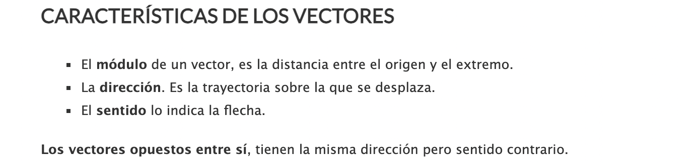

# Introducción a Algebra Lineal

## Filosofia de este curso

Si la matemática nunca fue lo tuyo, te invitamos a olvidar lo aprendido y a “empezar de cero”! El objetivo de este curso es de revisar conceptos fundamentales que van a ayudarte a entender mejor temas claves a la data/ data science como lo son la probabilidad, estadística o machine learning. 
Como hoy en día los cálculos los hace la computadora, y estamos conscientes de ello, no vamos a insistir en la resolución de ejercicios complejos que no solo lleva tiempo sino que puede traer frustración innecesaria. 
Por ello, abordaremos los temas seleccionados desde lo conceptual, con ejemplos precisos e invitandote a abrir la mente hacia una nueva manera de aprender matemática.
Por último, el fin de este documento es presentar un temario variado de conceptos que 
nos parecen importantes a tener en cuenta. P
ara que sea de fácil lectura, los temas no están desarrollados en gran profundidad. 
Por ello, es imperativo consultar los materiales adicionales propuestos en cada sección.
Además, te recomendamos fuertemente googlear los temas que te interesen o que necesiten más explicación.

Vamos!

## Temario

* Vector: dimensionalidad, dirección, módulo
* Productos escalar y vectorial
* Matrices y sus operaciones básicas

## Vector

Aunque no lo creas, utilizamos vectores constantemente en nuestra vida. Por ejemplo cuando
describimos un objeto o fenómeno, usamos varias dimensiones y no un simple escalar. Si queremos
decribir fisicamente una persona en general decimos **sexo, edad, altura, color de pelo y ojos**, 
y no simplemente **7,23**. Sin saberlo, estamos usando un **vector**.

En este ejemplo, estamos usando un vector de **dimension** 5, compuesto por las variables:
sexo: s, edad: e, altura: a, color pelo: cp, color ojos:co que se puede resumir como

**(s,e,a,cp,co)**

Una persona cualquiera puede estar descripta por este vector, por ejemplo:

**(s,e,a,cp,co) = (F, 28, 1.57, marron, negro)**

[comment]: <> (Como vimos en análisis, una función puede depender de varias variables)

Este vector tiene variables cuantitativas y cualitativas. Ya aprenderemos a trabajar
con ambos tipos durante esta carrera, pero por ahora nos vamos a concentrar en vectores
donde todos sus elementos son números reales.

La siguiente figura muestra un vector de dimension 3 dibujado en el espacio, donde cada una de sus componentes se
refleja en cada uno de los 3 ejes:

Los vectores se puede describir en base a sus componentes cartesianos, como vimos hasta ahora, 
o mediante su **módulo** y **dirección**. 

**Material adicional:**

* Lectura https://matematicasconmuchotruco.wordpress.com/2014/10/29/vectores-en-el-espacio/

[comment]: <> (* Video 1)

## Productos escalar y vectorial

https://economipedia.com/definiciones/producto-escalar-definicion-geometrica.html

## Matrices y sus operaciones básicas: suma, producto, determinante (y su significado)

Volviendo al ejemplo del principio, naturalmente podemos querer describir muchas personas a la vez.
Para ello, podemos hacer:

**(s,e,a,cp,co)**
1.(F, 28, 1.57, marron, negro)
2.(M, 33, 1.60, negro, marron)
3.(F, 12, 1.45, rubio, verde)
4.(X, 40, 1.80, marron, celeste)

De esta manera, acabamos de utilizar una matriz de dimension 5x4, es decir con 5 columnas determinadas
por las dimensiones de mi vector ya descrito antes y 4 por cada línea que representa aquí una persona diferente.

