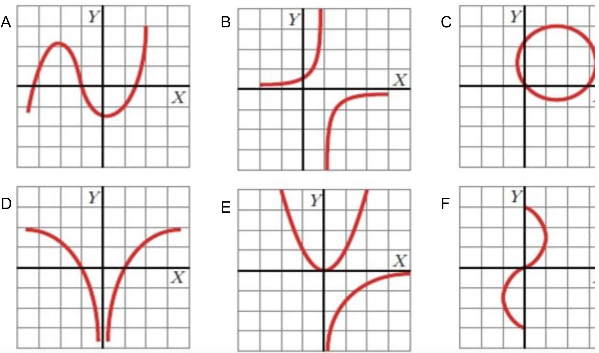
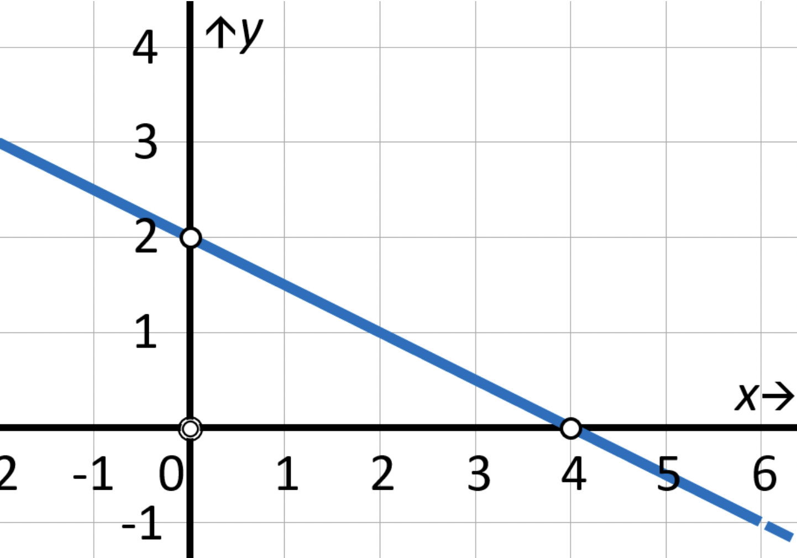

**1)** Responde para cada número con N, E, Re, Ra o I según sea Naturales, Enteros, Reales,
Racionales o Irracionales. Responder con la categoría más restrictiva, ej: 1 -> R: N.

    a- 198
    b- 4
    c- -3.1
    d- -1/4
    e- 10.0
    f- 2*e
    g- -123.0004

**2)** Calcula los siguientes porcentajes y y redondea la respuesta a su PRIMER número decimal

    a- 30% de 2000
    b- 2000% de 30
    c- 10% de 150
    d- 25.5% de 27
    e- 25.5% de 0.9

**3)** Calcula la relación porcentual entre los siguientes números y redondea la respuesta a su PRIMER número decimal. Ej: X% de 20 es 2 -> R: 10

    a- X% de 150 es 50
    b- X% de 4.0 es 100.0
    c- X% de 16/4 es 2
    d- X% de 10*Pi es 2*Pi
    e- X% de 3500 es 2500

**4)** De shopping compré varias prendas por un valor de 350$. Había una promo del 30% sobre la cual se aplico luego
un descuento con la tarjeta de fidelidad. Finalmente pagué 196$. Redondea la respuesta a su PRIMER número decimal.

    a- De qué porcentaje fue el descuento con la tarjeta de fidelidad?
    b- Cuánto dinero me ahorré por la promo y cuanto por la tarjeta de fidelidad?

**5)** Para cada medida en grados a continuación, responde con la letra que corresponde al ángulo de la figura.

  - 30
  - 45
  - 60
  - 90
  - 150
  - 120
  - 180
  - 90

**6)** Para un triángulo rectángulo de cateto_1 = 2, cateto_2= 3 e hipotenusa = 3.6, responde sobre el ángulo
menor (redondea la respuesta a su PRIMER número decimal):

    a- Cuál es su seno?
    b- Cuál es su coseno?
    c- Cuál es su tangente?

Usando las funciones inversas en la calculadora (o bien en internet) arccos, arcsin y/o arctan, responder:

    d- Cuántos grados mide el menor de los dos ángulos agudos?
    e- Y el mayor?

**7)** Elige la opción correcta para cada caso.

    a- 0 = 
        i- cos(0)
        ii- sen(0)
    b- 1 = 
        i- cos(0)
        ii- sen(0)
    c- -1 =
        i- cos(90)
        ii- sen(270)
    d- 0 =
        i- cos(180)
        ii- tg(180)

**8)** Responde V o F.

    a- log(3+4) = log(7)
    b- log(20) = log(10)+log(10)
    c- 2*log(5) = log(25)
    d- log(24) - 3*log(2) = log(3)

**9)** Para cada gráfica, responde si V o F "es función":

**10)** Para cada tabla, elige la función correspondiente.

    -A 
        i- f(x)= 4*x+1
        ii- f(x)= 3*x+2
        iii- f(x)= 3*x+1
        iv- f(x)= 5*x

    -B 
        i- f(x)= 2*x
        ii- f(x)= x^2+1
        iii- f(x)= 4*x
        iv- f(x)= x^2

    -C 
        i- f(x)= x/3
        ii- f(x)= x/2 + 1
        iii- f(x)= 0.5 * x
        iv- f(x)= 0.3 * x + 2

**11)** Sobre las funciones del ejercicio anterior, responde V o F.

    -A  
        - pendiente = 4
        - ordenada al origen = 2
        - no es una recta

    -B  
        - pendiente = 2
        - ordenada al origen = 0
        - no es una recta

    -C  
        - pendiente = 0.5
        - ordenada al origen = 1
        - no es una recta

**12)** Calcula la pendiente y ordenada al origen de la siguiente recta:

**13)** Calcula los siguientes límites. Redondea la respuesta a su PRIMER número decimal o responde inf en caso de infinito o -inf en caso de menos infinito.

    a- lim x->2 de f(x) = 2*x + 1
    b- lim x->0+ de f(x) = 1 - 1/x
    c- lim k->inf de g(k) = 10 + 1/log(k)
    d- lim h->10 de g(h) = 1/(h-10)
    e- lim t->5 de d(t) = 25-t^2
    f- lim x->-inf de f(x) = 1 - 1/x si x>0
                            -3 si x<=0

**14)** Responde V o F - continuidad

    a- La función g(j) = j + 3 es continua en todo su dominio
    b- La función g(j) = 3 * j - 2 no esta definida en todo R
       f(x) = 1 - 1/x si x>0
              -3 si x<=0
       c- posee una discontinuidad evitable en x=0
       d- posee una discontinuidad inevitable en x=0
       e- es igual a -3 en x=0
       f- es continua para x>2

**15)** Responde V o F - derivabilidad

    a- La función m(j) = log(j) no es derivable en todo su dominio
    b- Una función continua en todo su dominio es derivable en todo su dominio
    c- Una función h(j) es continua en j=3 si es derivable en j=3
       f(x) = x si x>0
              -x si x<=0
       d- es continua en x=0
       d- es derivable en x=0
       f- es derivable con derivada negativa en x=1
    g- La derivada de b(l) = l^2 en l = 0 es positiva
    h- La derivada de k(l) = l^2 en l = 0 es 0
    i- La derivada de b(r) = r^2 en r = 3 es positiva

**16)** Usando una tabla de derivadas, calcula el valor de la derivada en el punto indicado y redondea la respuesta a su PRIMER número decimal.

    a- f(x) = 2*x + 1, f'(2) = ?
    b- f(x) = x^2, f'(0) = ?
    c- f(x) = x^3 - 2, f'(2) = ?

    
**17)** Responde V o F en cada caso:

    La función    f(x) = (x-1)^2 si x>0
                         (-1)*(x+1)^2 si x<=0
    
    a- Tiene un máximo en x=1
    b- Tiene un máximo en x=-1
    c- Es continua en x=0
    d- Tiene una discontinuidad inevitable finita en x=1
    e- Tiene un mínimo en x=-1
    f- f'(4)>0
