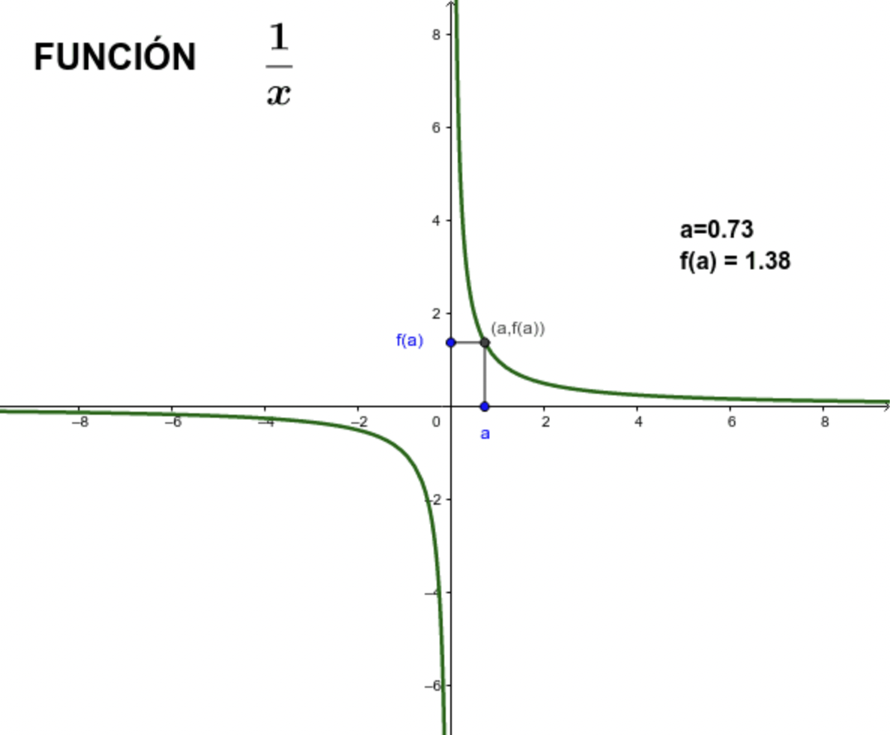
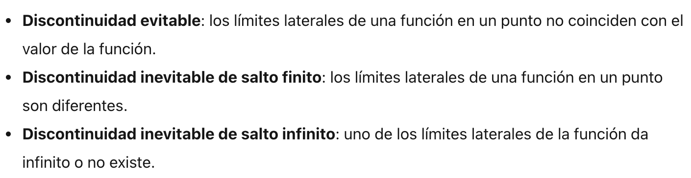
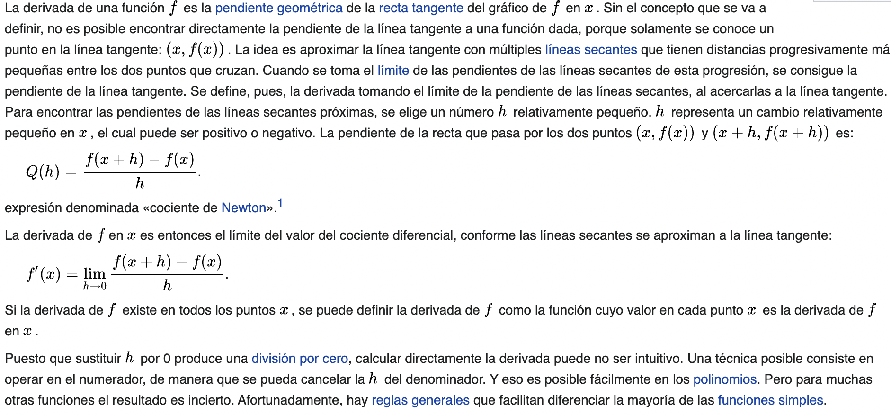
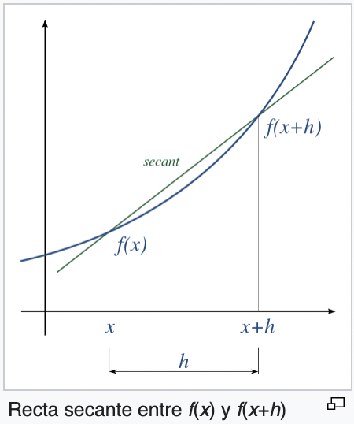

## Grabación de la Clase 2

 

  <iframe src="https://player.vimeo.com/video/688590065?h=833661e909" allow="autoplay; fullscreen" allowfullscreen></iframe>

# Introducción a Cálculo I

## Temario

* Continuidad
* Derivabilidad
* Función discreta: concepto
* Función multivariable: concepto

## Continuidad

### Comentario general

En análisis matemático nos preguntamos a menudo sobre qué sucede en cada punto del dominio de una función.
Por suerte, para la gran mayoría de las funciones que utilizamos para representar fenómenos, estas condiciones se repiten en "casi" todos o
todos los puntos del dominio. 
Nos interesa en general, entonces, entender si existen excepciones o puntos especiales y qué sucede en esos casos.

### Límites

Cuando hablamos de límites, nos interesa saber qué sucede **alrededor** de un cierto punto del 
dominio (o no) de una función.

Tomemos la función 

**y = f(x) = 1/x** (se lee **y** es igual a una función de **x** y es igual a unos sobre **x**)

El dibujo de su gráfica es el siguiente:

Como lo hemos mencionado, el dominio natural de esta función es D=R-{0} (todos los reales menos el 0) ya que
no se admite dividir por cero. Por otro lado, cualquier otro número es válido en esa ecuación.

Como dijimos, nos interesa entender como se comporta la función en cada punto y en particular si hay puntos
donde su comportamiento es diferente. Tomemos un punto cualquiera, por ejemplo **a** (imagen). Queremos saber 
qué pasa con **f(x)** cuando x "se acerca a" **a**. Como estamos en una dimensión, puedo acercarme a un elemento del 
dominio por dos caminos: derecha o izquierda (numeros mayores que **a** o menores).

Si me acerco a **a** por izquierda (es decir, valores menores que **a** o también: **lim (-) x -> a**, límite
por izquierda cuando **x** tiende a **a**) 
siguiendo la flecha rosa en la imagen, se ve que 
la función (**y = f(x)**) se va acercando a **f(a)**. Recuerden que el **limite** se interesa a lo
que pasa **alredor**
de un punto, y no **en** en punto en si. Si ahora hago el mismo ejercicio acercándome por derecha
(valores mayores que **a** o también: **lim (+) x -> a**, límite
por derecha cuando **x** tiende a **a**) siguiendo la flecha
roja en la imagen, la función (**y = f(x)**) se va acercando a **f(a)**, al igual que en su límite
por izquierda.

Para el punto **a** podemos decir, entonces, que ambos limites por derecha e izquierda existen, son finitos e iguales.
Ya se que a esta altura el análisis de limites parece bastante trivial y de poca utilidad, sigamos.

Miremos ahora a ver qué pasa alrededor del punto **x=0** (no en **x=0** ya que es un 
punto fuera del dominio donde la función ni siquiera está definida).

Si nos vamos acercando al 0 por derecha, vemos que los valores de la función se hacen cada vez mayores. Mientras
mas chico sea el valor de **x**, mayor será el valor de **f(x)**. En este caso, se dice que el limite por derecha de la función cuando
**x** tiende a **0** es **infinito** (o **lim (+) x-> 0 = Inf**). Este comportamiento donde los valores
de una función se acercan infinitamente a un eje o una recta si jamás tocarlo se llama **asíntota**.
Si nos acercamos al 0 por izquierda, vemos que los valores de la función se hacen cada vez menores
(ya que son valores negativos, en **módulo** o **valor obsoluto** los valores son cada vez mayores).
 En este caso, se dice que el limite por izquierda de la función cuando
**x** tiende a **0** es **menos infinito** (o **lim (-) x-> 0 = -Inf**).

En el caso de **x=0** y a diferencia de **x=a**, los límites por derecha e izquierda existen, 
pero NO son finitos ni tampoco iguales entre sí.

[comment]: <> (**ejercicios y videos mas ejemplos! hay miles, por ejemplo funcion escalonada. interesante ver su definicion )

[comment]: <> (analitica**)

[comment]: <> (**Material adicional:**)

[comment]: <> (* Lectura 1)

[comment]: <> (* Video 1)

### Continuidad

Con el concepto claro de límite, la continuidad se hace sencilla a describir. 
Tomemos el punto **x=a** de la sección anterior. Como vimos, los límites por izquierda y derecha son finitos

**lim (+) x -> a = lim (-) x -> a = f(a)** 

e iguales a **f(a)**, es decir, el valor de la función en el punto.

Con estos 3 elementos:

* Los limites por derecha e izquierda existen y son finitos
* Los limites por derecha e izquierda son iguales entre sí
* Los limites por derecha e izquierda son iguales al valor de la función en el punto

podemos entonces afirmar que "la función es **continua** en **a**".

Haciendo un poco de abstracción, podemos ver que todos los puntos del dominio de la función se comportan igual que **a** (además de poder
demostrarse analíticamente, por supuesto). En estos casos, se dice que la función es **continua** (se sobreentiende que
hablamos de "en todo su dominio" y no es necesario aclararlo ya que no se le puede pedir a una función que sea de una
manera u otra en lugares donde no existe).

Definamos ahora una función de **x** que llamaremos **k**, de manera que **k(x) = 1/x** cuando **x** sea distinto de
0 y **k(x) = 0** cuando **x=0**:

El dominio de **k(x)** son todos los reales. En cualquier punto distinto de 0, **k** tiene las mismas características que la función **f(x)** que ya analizamos.
Qué sucede EN **x=0**? Analicemos si es continua:

* Los limites por derecha e izquierda existen y son finitos? **NO**
* Los limites por derecha e izquierda son iguales entre sí? **NO**
* Los limites por derecha e izquierda son iguales al valor de la función en el punto? **NO**

Ahora si podemos decir que la función **k(x)** es continua en R-{0} y es discontinua en 0.

Por último, veamos que sucede con **j(x)**, con dominio en todos los reales

Qué sucede EN **x=2,5**? Analicemos si es continua:

* Los limites por derecha e izquierda existen y son finitos? **SI**
* Los limites por derecha e izquierda son iguales entre sí? **SI**: **lim (+) x -> 2,5 = lim (-) x -> 2,5 = 1/2,5** 
* Los limites por derecha e izquierda son iguales al valor de la función en el punto? **NO**: **j(x) = 2,5 != 1/2,5**

La función **j(x)** es continua en R-{0;2,5} y es discontinua en 0 y en 2,5. 
La discontinuidad en el punto **x=2,5** es del tipo "evitable" mientras que en **x=0** es del tipo "inevitable de salto infinito".

Los distintos tipos de discontinuidad son:

De los que podrás saber mas siguiendo el material adicional.

**Material adicional:**
* Lectura: https://www.funciones.xyz/tipos-de-discontinuidades/

[comment]: <> (* Video 1)

[comment]: <> (* )

## Derivabilidad

Ya vimos que nos interesa saber si una función es continua o no en los puntos de su dominio. 
Esto garantiza que ciertas propiedades matemáticas
y teoremas se podrán aplicar en esos puntos. Pero la continuidad es solo el comienzo. 
Ahora, vamos a analizar si una función es
**derivable** en su dominio.

El concepto de derivabilidad se relaciona con que tan suave es una función, que a su vez es una medida de 
la predescibilidad de lo que sucederá en un punto **x+a, a en R** conociendo lo que sucede en **x**. Saber que una función es
continua es ya una gran ayuda en este sentido, ya que si conozco **f(x)** se que **f(x+a)** no puede estar muy lejos.
Ahora, hay casos donde una función es continua y aún asi es dificil saber que pasar en **f(x+a)**. Imaginemos
un pico "puntiagudo", si nos paramos en la cima del pico, cualquier pasito que demos por mas chiquito, 
podemos ir a parar muy "lejos". En cambio, en una cima "suave" como la de una sierra, por mas que demos un paso
grande sabemos que no nos vamos a caer. Estos ejemplos se muestran en la siguiente figura:

Mas concretamente, una función es derivable en un punto **x0** si se puede construir una recta tangente a la funcieon
en ese punto. La pendiente de la recta tangente representa la taza de crecimiento (positivo, negativo o nulo) que presenta la
función en ese punto. Entre las muchisimas aplicaciones de este concepto, esta el hecho de poder simplificar
el comportamiento de una función compleja (o desconocida!) a una simple recta, siempre y cuando trabajemos de manera local (cerca del punto **x0**).
Esta ida de trabajar "cerca de" un punto, o de subdividir un problema grande es muchas partes infinitecimales es 
central en el análisis matemático, como seguiremos viendo, y da origen a conocidas notaciones como
**dx**.

Wikipedia, sabiamente, describe:

*La derivada de una función es la razón de cambio instantánea con la que varía el valor de dicha función
matemática, según se modifique el valor de su variable independiente.
La derivada de una función es un concepto local, es decir, se calcula como el límite de la rapidez de 
cambio media de la función en cierto intervalo, cuando el intervalo considerado para la variable 
independiente se torna cada vez más pequeño. Por eso se habla del valor de la derivada de una 
función en un punto dado.*

*Un ejemplo habitual aparece al estudiar el movimiento: si una función representa la posición de un 
objeto con respecto al tiempo, su derivada es la velocidad de dicho objeto para todos los momentos. 
Un avión que realice un vuelo transatlántico de 4500 km entre las 12:00 y las 18:00, viaja a una velocidad 
media de 750 km/h. Sin embargo, puede estar viajando a velocidades mayores o menores en distintos tramos de la
ruta. En particular, si entre las 15:00 y las 15:30 recorre 400 km, su velocidad media en ese tramo es
de 800 km/h. Para conocer su velocidad instantánea a las 15:20, por ejemplo, es necesario calcular la 
velocidad media en intervalos de tiempo cada vez menores alrededor de esta hora: entre las 15:15 y las 
15:25, entre las 15:19 y las 15:21.*

*Entonces el valor de la derivada de una función en un punto puede interpretarse geométricamente, 
ya que se corresponde con la pendiente de la recta tangente a la gráfica de la función en dicho punto. 
La recta tangente es, a su vez, la gráfica de la mejor aproximación lineal de la función alrededor de 
dicho punto. La noción de derivada puede generalizarse para el caso de funciones de más de una variable 
con la derivada parcial y el diferencial.*

Una vision que puede resultar práctica del concepto de derivada es la que sale de imaginar una recta secante que pasa por dos
puntos *x* y *x+h* y luego hacemos *h* muy chiquito (*lim h -> 0*) hasta que *x* y *x+h* esten muy cerca
y la recta secante se convierta en la tangente en *x*:

Para **calcular** el valor de una derivada en un punto, se debe resolver el limite planteado en la
expresión siguiente

que significa, literalmente, la taza de cambio de una función entre un punto **x** y su entorno muy cercano
(**x+h** con **h -> 0**).

En este curso no vamos a pedir que el alumno pueda resolver este ejercicio, sino qe vamos a usar tablas de derivadas que
se encuentran facilmente en internet.

Otra manera interesante de entender las derivadas es relacionando con la velocidad, como lo pueden ver en este video:

https://www.youtube.com/watch?v=uK4-s0ojHFg&ab_channel=Matem%C3%A1ticasprofeAlex

### Análisis funcional y puntos críticos

En general, hay ciertos puntos de una función que nos interesan mas que otros ya que definen momentos clave del fenómen
que estan modelizando. 

Imaginemos que quiero determinar cuantas horas debería dormir por noche para estar óptima en rendimiento al dia siguiente.
Podría diseniar un experimento en el cual cada dia duermo una cantidad distinta de horas, y al dia siguiente noto
de 1 a 10 mi nivel de energía y obtener una curva de este estilo:

Lo que quiero saber, claramente, es: cuantas horas corresponden al maximo de energía?

Una manera de resolver este ejercicio es usando derivadas. Para puntos anteriores al máximo las derivadas 
(pendientes de la recta tangente) son postivas y cada vez mayores (la pendiente se va agudizando). Luego 
del máximo, al contrario, las rectas son descendientes ergo sus pendientes negativas. Porque un teorema 
dice (créanme) que en una función continua que pasa por valores positivos y negativos tiene que si o si haber pasado por cero (tiene sentido)
y que para la gran mayoria de aplicaciones le derivada es una función continua en si misma, quiere decir que e valor de 
la derivada tiene que ser cero en algun momento. En particular, es 0 cuando pasa de aumentar a disminuir, ergo,
en el valor máximo de la función. Entonces, una manera de determinar cuando una función se maximiza es obteniendo
el o los puntos en que su derivada es nula. Atención! Esto también sirve para los valores mínimos y los puntos de inflexión. 

Para distinguir entre un maximo, un minimo y un punto de inflexión se debe también tener en cuenta la concavidad de la curva (determinada por
el signo de la derivada segunda) y los valores de la función antes y después del punto crítico.

[comment]: <> (Ejemplo: análisis funcional completo)

## Integrales - Concepto

Antes de empezar, es importante aclarar que existen dos tipos de integrales cuyo significado difiere completamente:
*definidas* e *indefinidas*. La primera tiene una significación geométrica respecto de la curva que describe una función
mientras que la segunda refiere a una operación matemática y en particular corresponde a la inversa de la derivada.

### Integrales definidas

Como con la derivación, la integral también plantea la division de la función en partecitas para calcular el área de cada una de ellas
y luego sumarlas. Esto se llama "sumas de Riemann" y es una parte clave del cálculo integral:

Finalmente, cuál es la relación entre la integral definida y la indefinida, o la inversa de la derivada?
Respuesta en este texto:

**Material adicional:**
* Lectura 1: https://www.fisicalab.com/apartado/derivabilidad-continuidad
* Lectura 2: https://es.wikipedia.org/wiki/Punto_cr%C3%ADtico_(matem%C3%A1tica)
* Lectura 3: https://www.hiru.eus/es/matematicas/la-integral-definida
* Video 1: https://www.youtube.com/watch?v=uK4-s0ojHFg&ab_channel=Matem%C3%A1ticasprofeAlex

## Función discreta: concepto

Volviendo al ejemplo de nuestra fábrica de galletitas, no tiene sentido hablar de 1,5 galletitas o de 3,222 paquetes.
en realidad, y sin mencionarlo, estabamos trabajando con una **función discreta**:

Las funciones discretas son muy usadas en computación (-)ya que el mundo digital en si es discreto, como han visto en el
curso introductorio en Python), análisis de seniales y en el mundo de la data, ya que es una manera apropiada de modelar ciertos fenómenos como
nuestra fábrica de galletitas.

[comment]: <> (**Material adicional:**)

[comment]: <> (* Lectura 1)

[comment]: <> (* Video 1)

## Función multivariable: concepto

Hasta ahora vimos funciones en 2D, es decir con dos variables, donde una era la variable independiente (muchas veces llamada **x** y
colocada en el eje horizontal en la gráfica de la curva) y la otra la variable dependiente. Ahora bien, muchos (la mayoría) de los fenómenos 
no dependen de una sola variable. Por ejemplo, la cantidad de paquetes de galletitas que produce mi fábrica por día va a depender de los kg de harina
como hemos considerado pero también de cuánto personal hay presente en el día, de si todas las máquinas funcionan corrientemente,
la disponibilidad de todos los ingredientes, etc. Ver solo el problema en función de la cantidad de harina
es un enfoque preciso (o corte en el espacio multidimensional) de un problema mucho mayor.
Cada variable agrega una dimensión en el espacio y por ende podemos tener gráficas en 2D, 3D, 4D,... 10D, etc.
Lamentablemente, nuestro cerebro, no puede visualmente captar mas de 4 o 5 dimensiones (3D en volúmen+colores+tiempo). Mas allá de 
este límite no podemos entonces representar gráficamente mas que cortes o enfoques de nuestro problema.

Todo el cálculo que vimos en este curso con sus límites, derivadas y análisis funcional existe por supuesto para multiples dimensiones,
y se vuelve (un poquito...) mas complejo. No vamos a entrar en detalles pero si te interesa te invito a leer mas sobre este mundo pasionante.
Un concepto que vale la pena mencionar es el de **gradiente** ya que se utiliza mucho en machine learning, modelado  otras aplicaciones que nos interesan.
El **gradiente** es el equivalente a la derivada que hemos visto pero para funciones multivariables. La derivdad es la medida
del crecimiento (o decrecimiento) de una función de una variable y se expresa con un escalar (un número). Este mismo concepto de puede aplicar a funciones multivariables, pero como 
ahora hay muchas direcciones diferentes para un mismo punto y cada dirección tiene su propia medida de crecimiento, se expresa con un grupo de vectores (es decir, un grupo de flechitas posicionadas en el 
espacio que apuntan hacia la dirección de máximo crecimiento).

Esta imágen muestra a la iquierda una curva en 3D. Si cortamos mentalmente donde indica el arco rojo y proyectamos en 
un plano, obtenemos una simple parábola como vemos a la derecha.

Ahora bien, podemos imaginar que rotamos la misma parábola alrededor del eje vertical, y en 3D obtenemos una curva de ste estilo:

## Homework

Completa la tarea descrita en el archivo [README](https://github.com/soyHenry/Math4Data/blob/main/02-Intro-Calculo-II/Ejercicios_Clase2_Solucion.md)

<table class="hide" width="100%" style='table-layout:fixed;'>
  <tr>
    <td>
      <a href="https://airtable.com/shrSzEYT4idEFGB8d?prefill_clase=00-PrimerosPasos">
        
         
        Hacé click acá para dejar tu feedback sobre esta clase.
      </a>
    </td>
  </tr>
</table>