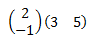
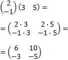
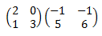
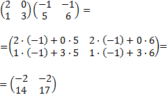
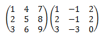
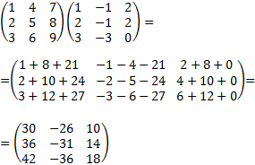
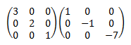
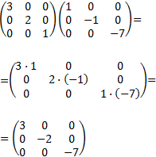
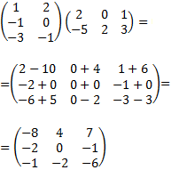

**1)** Responde Verdadero o Falso

    a- Los vectores se pueden describir en base a su módulo y dirección
        Verdadero
    b- Los vectores se pueden describir en base a sus componentes cartesianos
        Verdadero
    c- Dos vectores pueden tener misma dirección pero distinto sentido
        Verdadero
    d- Dos vectores no pueden tener mismo módulo pero direcciones distintas
        Falso

**2)** ¿Cuál es el módulo de los siguientes vectores?

    a- (3,4)        5
    b- (1,1)        √2
    c- (10,10)      √200
    d- (-3,-4)      5

**3)** Resolver las siguientes multiplicaciones de vectores por escalares

    a- (1,1) * 3            (3, 3)
    b- (12,15) * 1/3        (4, 5)
    c- (10,1) * 10          (100, 10)
    d- (4,5) * 5            (20, 25)

**4)** Responder Verdadero o Falso

    a- El producto escalar de dos vectores obtiene multiplicando entre sí la norma de cada vector y el coseno del ángulo que se forma entre ellos.
        Verdadero
    b- El producto escalar siempre da como resultado un escalar.
        Verdadero
    c- El producto vectorial da como resultado otro vector.
        Verdadero
    d- Si dos vectores son paralelos, el angulo entre ellos es 90 grados.
        Falso

**5)** ¿Que dimensiones tienen las siguientes matrices?

    a- 5 filas y 7 columnas     (5 x 7)
    b- 2 columnas y 9 filas     (9 x 2)
    c- 3 filas y 3 columnas     (3 x 3)

**6)** Responder con Si/No si es posible realizar las siguientes operaciones entre matrices:

    a- (3 x 4) + (1 x 2)        No
    b- (1 x 1) + (1 x 1)        Si
    c- (8 x 8) - (1 x 1)        No
    d- (4 x 2) - (2 x 3)        No
    d- (4 x 2) * (2 x 3)        Si

**7)** Realizar la multiplicación entre las siguientes matrices:

a-

 

 
 
b-

 

 
 
c-

 

 
 
d-

 

 
 
e-

 

 
 