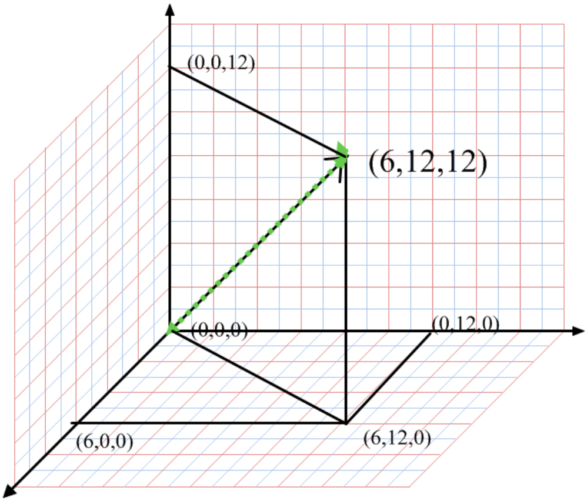
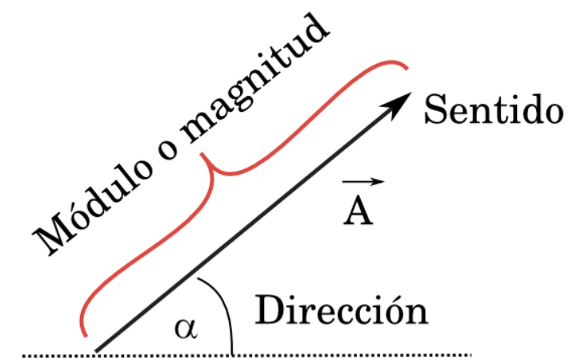
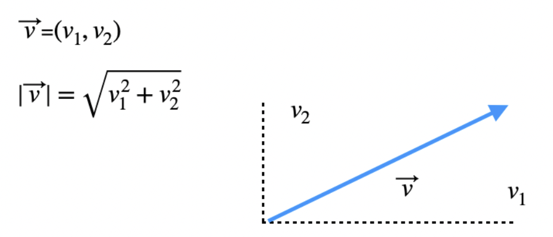
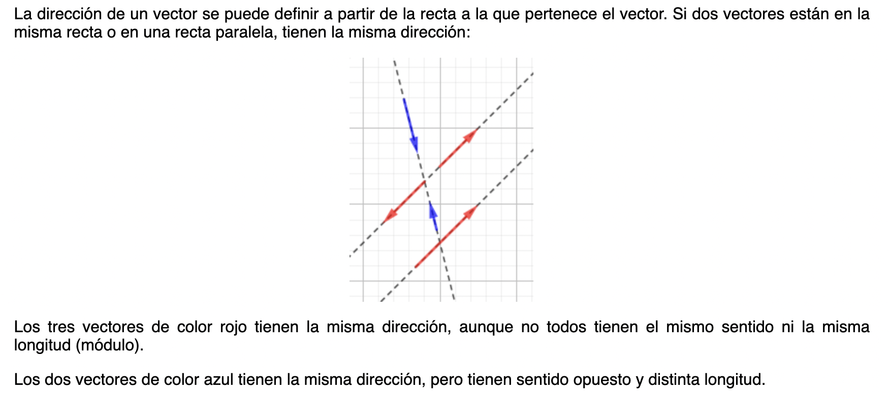
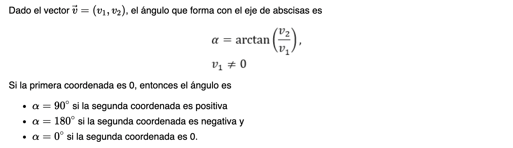
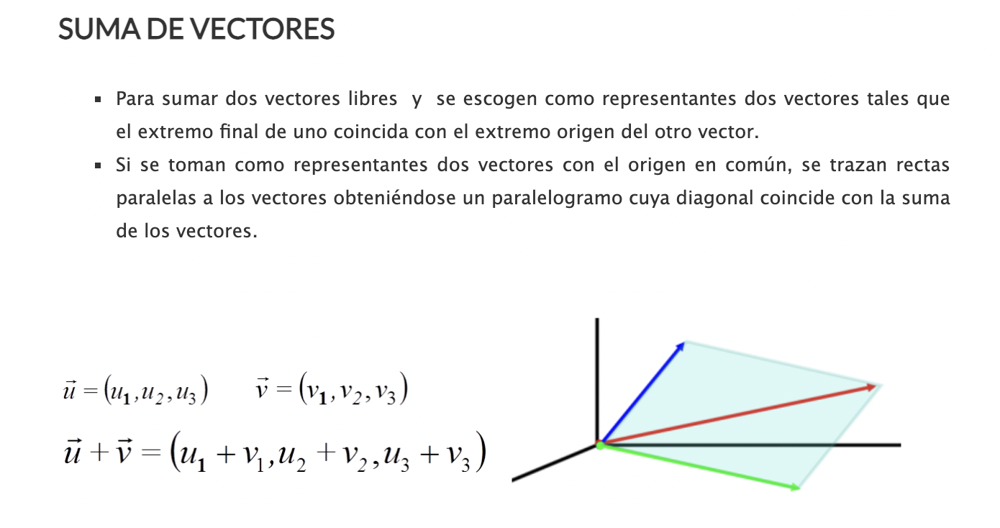
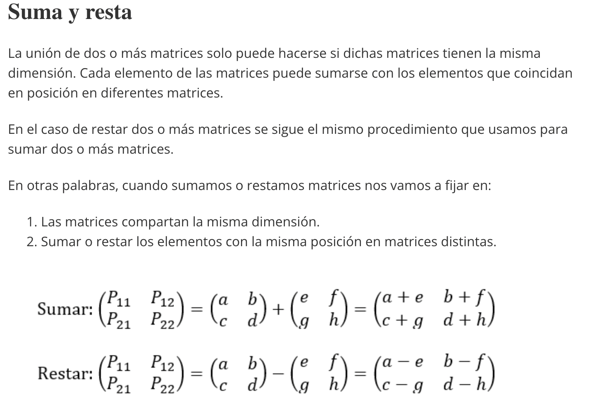
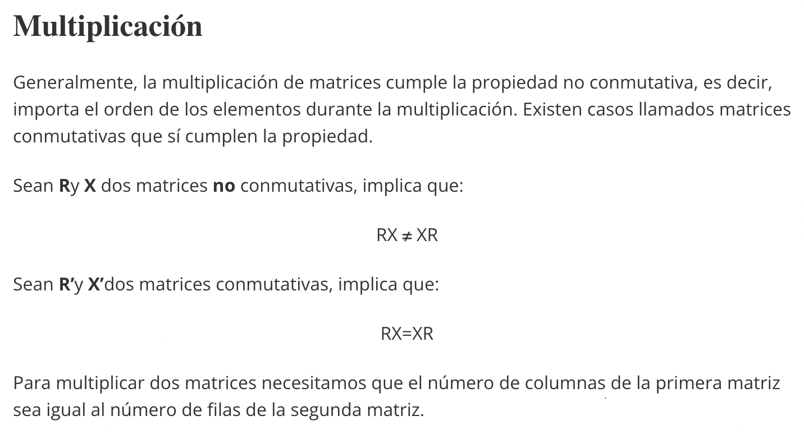

## Grabación de la Clase 3

  <iframe src="https://player.vimeo.com/video/681007701" allow="autoplay; fullscreen" allowfullscreen></iframe>

# Introducción a Algebra Lineal

## Temario

* Vector: dimensionalidad, dirección, módulo
* Productos entre vectores
* Matrices 

## Vector

Aunque no lo creas, utilizamos vectores constantemente en nuestra vida. Por ejemplo cuando
describimos un objeto o fenómeno, usamos varias dimensiones y no un simple escalar. Si queremos
describir físicamente una persona en general decimos **sexo, edad, altura, color de pelo y ojos**, 
y no simplemente **7,23**. Sin saberlo, estamos usando un **vector**.

En este ejemplo, estamos usando un vector de **dimension** 5, compuesto por las variables:
sexo: s, edad: e, altura: a, color pelo: cp, color ojos:co que se puede resumir como

**(s,e,a,cp,co)**

Una persona cualquiera puede estar descripta por este vector, por ejemplo:

**(s,e,a,cp,co) = (F, 28, 1.57, marron, negro)**

[comment]: <> (Como vimos en análisis, una función puede depender de varias variables)

Este vector tiene variables cuantitativas y cualitativas. Ya aprenderemos a trabajar
con ambos tipos durante esta carrera, pero por ahora nos vamos a concentrar en vectores
donde todos sus elementos son números reales.

La siguiente figura muestra un vector de dimensión 3 dibujado en el espacio, donde cada una de sus componentes se refleja en cada uno de los 3 ejes:

Los vectores se puede describir en base a sus componentes cartesianos, como vimos hasta ahora, o mediante su **módulo** y **dirección**. 

El módulo de un vector **v** se designa como **|v|** y se calcula como la raíz cuadrada de la suma de sus componentes al cuadrado:

Se dice que un vector está normalizado cuando su módulo es igual a 1. Para normalizar un vector, hay que dividir cada una de sus componentes por el valor de su módulo (también llamado norma).

Para calcular la dirección de un vector, se utiliza el ángulo que forma en el espacio con la horizontal. Teniendo en cuenta que un vector con origen en el origen de coordenadas es la hipotenusa de un triángulo rectángulo, podemos encontrar el ángulo que define su dirección como:

Los vectores pueden **sumarse** entre sí, siempre y cuando tengan la misma dimensión simplemente sumando cada una de sus componentes.
También puede multiplicarse por un escalar (es decir un número no vectorial) multiplicando el mismo por las componentes del vector. 

Sin embargo, cuando hablamos del producto de dos vectores la realidad se vuelve un poquito más compleja y lo mostramos a continuación.

**Material adicional:**

* Lectura 
  * https://matematicasconmuchotruco.wordpress.com/2014/10/29/vectores-en-el-espacio/
  * https://www.fisic.ch/contenidos/introducci%C3%B3n-a-la-f%C3%ADsica/vectores/
  * https://economipedia.com/definiciones/modulo-de-un-vector.html
  * https://www.matesfacil.com/BAC/geometria2D/diferencias-modulo-direccion-sentido-vector-longitud-ejemplos.html

## Productos entre vectores

Hay dos tipos de producto entre vectores con usos y significados bien diferentes. La primer diferencia, como su nombre lo indica, es el tipo de resultado que se obtiene. El producto **escalar** también conocido como producto punto da como resultado un escalar y se obtiene
como la suma del producto de las componentes de ambos vectores. El producto **vectorial** también llamado producto cruz da como resultado un vector y la manera de obtenerlo es un poco más compleja y no veremos en detalle.

Otra manera de calcular el producto escalar es multiplicando entre sí la norma de cada vector y el coseno del ángulo que se forma entre ellos:

Esta interpretación es muy útil ya que nos permite saber rápidamente si dos vectores son paralelos (**cos(0)=1**), antiparalelos (**cos(180)=-1**) o perpendiculares (**cos(90)=0**).

**Material adicional:**

* Lectura https://economipedia.com/definiciones/producto-escalar-definicion-geometrica.html

## Matrices

Volviendo al ejemplo del principio, naturalmente podemos querer describir muchas personas a la vez. Para ello, podemos hacer:

**(s,e,a,cp,co)**

1.(F, 28, 1.57, marron, negro)

2.(M, 33, 1.60, negro, marron)

3.(F, 12, 1.45, rubio, verde)

4.(X, 40, 1.80, marron, celeste)

De esta manera, acabamos de utilizar una matriz de dimensión 5x4, es decir con 5 columnas determinadas por las dimensiones de mi vector ya descrito antes y 4 por cada línea que representa aquí una persona diferente.

Una matriz se puede entender entonces como un conjunto de vectores que forman sus filas: en este caso cada fila es un vector que describe una persona; o sus columnas: en este caso cada columna representa diferentes valores de una característica física diferente.

En ciencia de datos usamos matrices o estructuras similares constantemente ya sea simplemente para guardar datos (tablas) o para describir y modelizar fenómenos donde cada individuo se describe con un vector de características o vector de *features* como en este caso. Más adelante nos van a interesar cosas como si los vectores de una matriz son lo suficientemente diferentes entre sí como para que justifique cada uno su existencia: queremos una matriz muy grande si muchos de sus vectores son el mismo o muy parecido o podemos "resumirla"?

Por ahora, es importante saber que se puede realizar operaciones entre matrices como entre vectores como la suma y la multiplicación.

**Material adicional:**

* Lectura https://economipedia.com/definiciones/operaciones-con-matrices.html#:~:text=Las%20operaciones%20con%20matrices%20son,la%20divisi%C3%B3n%20y%20la%20multiplicaci%C3%B3n.&text=La%20dimensi%C3%B3n%20de%20una%20matriz,la%20dimensi%C3%B3n%20de%20las%20columnas.

## Homework

Completa la tarea descrita en el archivo [README](https://github.com/soyHenry/Math4Data/blob/main/03-Intro-Algebra-Lineal/Ejercicios_Clase3_Solucion.md)

<table class="hide" width="100%" style='table-layout:fixed;'>
  <tr>
    <td>
      <a href="https://airtable.com/shrSzEYT4idEFGB8d?prefill_clase=00-PrimerosPasos">
        
         
        Hacé click acá para dejar tu feedback sobre esta clase.
      </a>
    </td>
  </tr>
</table>